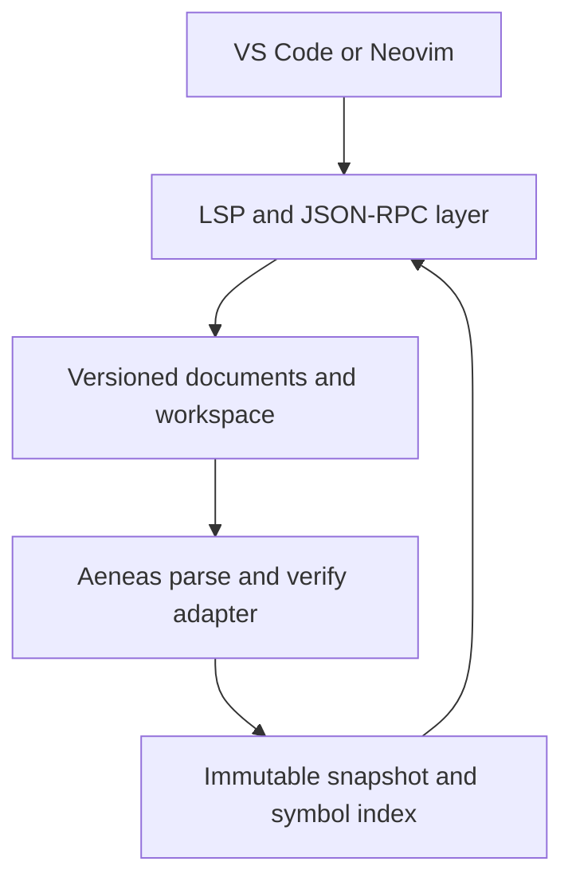

# Virgil Language Server

[](https://github.com/SaltedTan/virgil-language-server/actions/workflows/ci.yml)

A [Language Server Protocol](https://microsoft.github.io/language-server-protocol/) implementation for the [Virgil](https://github.com/titzer/virgil) programming language, written in Virgil and built on the Aeneas compiler's own parser and type checker.

> **Unofficial project.** This is an independent community tool. It is not affiliated with or endorsed by the Virgil maintainers.

> **Status: pre-alpha (milestone M0).** The repository builds an executable that links the Aeneas front end and can report syntax errors from the command line. It does **not** speak LSP yet. See [ROADMAP.md](ROADMAP.md) for the plan.

## Why

Virgil has a self-hosted compiler but no editor intelligence for unsaved buffers. Running `v3c` on save gives diagnostics for saved files only. It can't provide go-to-definition or hover, which need the compiler's bound syntax tree. This project runs Aeneas's parser and verifier inside a long-lived server process, so editors get the compiler's real semantics instead of a reimplementation.

## v0.1 scope

One `virgil-lsp` executable, used by both LazyVim/Neovim and VS Code, providing:

- `.v3` file detection
- parser and type-checker diagnostics for unsaved buffers
- document symbols
- go-to-definition for locals, members, methods, and named types
- hover with declaration signatures and inferred types
- a `.virgil-lsp.json` project file describing which sources form a program

Completion, references, rename, and incremental analysis come after v0.1. Formatting and debugging are out of scope.

## Architecture



One process owns the protocol, the in-memory document overlays, the compiler front end, and the semantic index. Editor integrations stay thin and contain no language semantics. All compiler access goes through a single adapter (`src/analysis/`). See [docs/architecture.md](docs/architecture.md) and the [decision records](docs/decisions/).

## Building

Requirements: Linux or macOS on x86-64, `git`, `make`, and `bash`. The Virgil compiler comes from the pinned submodule, so you don't need a separate Virgil install.

```sh
git clone --recurse-submodules https://github.com/SaltedTan/virgil-language-server.git
cd virgil-language-server
make test        # builds build/virgil-lsp and runs all tests
```

Try the current development command:

```sh
build/virgil-lsp --version
build/virgil-lsp parse test/fixtures/syntax/tab-error.v3
```

See [docs/development.md](docs/development.md) for details.

## Editor setup

Editor integration is not usable until milestone M2. Work-in-progress configuration lives in [`editors/nvim/`](editors/nvim/) and [`clients/vscode/`](clients/vscode/).

## Contributing

Bug reports, documentation, tests, and code are all welcome. Please read [CONTRIBUTING.md](CONTRIBUTING.md) and the [Code of Conduct](CODE_OF_CONDUCT.md). Report security issues as described in [SECURITY.md](SECURITY.md).

## License

Licensed under the [Apache License, Version 2.0](LICENSE). The pinned Virgil compiler in `vendor/virgil` is a separately licensed upstream dependency; see [THIRD_PARTY_NOTICES.md](THIRD_PARTY_NOTICES.md).
