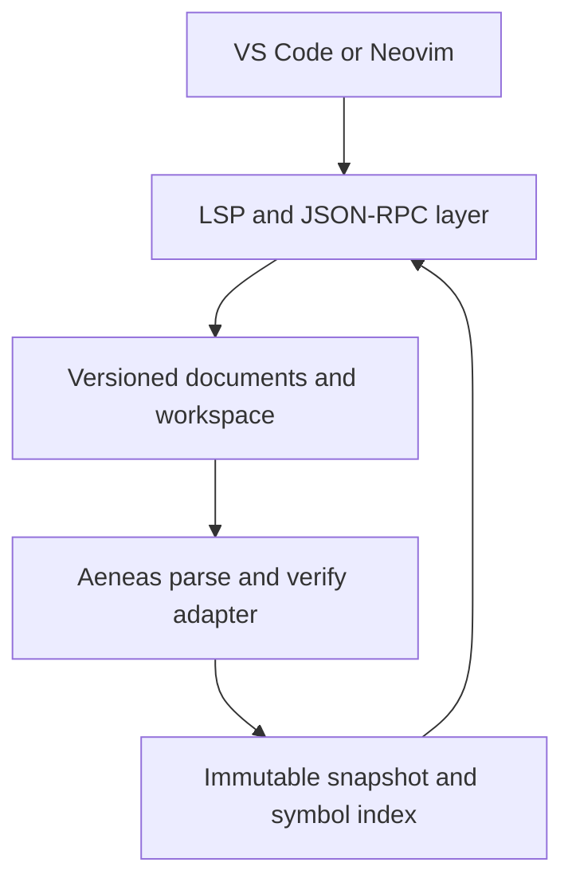

# Architecture

This document describes the intended structure of the server. Sections marked *planned* describe work in later milestones. See [ROADMAP.md](../ROADMAP.md) for the schedule.

## Overview

`virgil-lsp` is one process that communicates with the editor over standard input/output. It owns the protocol layer, the in-memory document overlays, the compiler front end, and the semantic index. Editor integrations only launch the process and forward configuration.

## Source layout

| Directory | Responsibility | Status |
| --- | --- | --- |
| `src/main.v3` | Command-line entry point | Present |
| `src/Log.v3` | Logging to standard error. Standard output is protocol-only. | Present |
| `src/analysis/` | **The only code that touches Aeneas.** Adapter, analysis snapshots, symbol indexes. | Adapter spike present |
| `src/protocol/` | Byte framing, JSON-RPC message model, server request tracking, lifecycle state machine | Message model, framing, stdio transport, server request tracking, and lifecycle present |
| `src/documents/` | URIs, versioned text, `PositionMap` | `PositionMap` present; URIs and versioned text planned (M2) |
| `src/workspace/` | `.virgil-lsp.json`, glob expansion, project contexts, scheduling | Planned (M3) |
| `src/features/` | Diagnostics, symbols, definition, hover, and later features | Planned (M2–M5) |

## Build model

Virgil is a whole-program compiler. Every source file is passed to the compiler at once and shares one global namespace. The `virgil-lsp` executable is compiled from:

1. `src/main.v3` (passed first, because the first component with a `main` method becomes the entry point);
2. the rest of `src/`;
3. a generated `build/gen/BuildInfo.v3` with the version and revisions;
4. `vendor/virgil/aeneas/src/*/*.v3` and the libraries listed in `vendor/virgil/aeneas/DEPS`;
5. `vendor/virgil/lib/file/json/JsonParser.v3`, which the server uses but Aeneas does not.

Aeneas has its own `main`, but it comes later on the command line, so it isn't selected. Because all names share one namespace, server types must not reuse Aeneas top-level names ([ADR-0002](decisions/0002-pinned-virgil-adapter-boundary.md)).

## Compiler adapter

The adapter (`src/analysis/AeneasAdapter.v3`) exposes compiler functionality in server-owned types:

- `parseFile(path, bytes)` runs `Parser.parseFile` on in-memory bytes and returns `AnalysisDiagnostic`s and a declaration count. *(present)*
- `analyzeProgram(sources)` builds a fresh `Program` from in-memory `AnalysisSource`s and runs `Compilation.parse()`, then `Compilation.verify()` if parsing succeeded. It returns a `ProgramAnalysis` with diagnostics and timing. Nothing is read from disk. Without a target, Aeneas supplies a synthetic `System` component, as it does for its interpreter. *(present; disk sources plus overlays come with the project model in M3)*
- `ProgramAnalysis.occurrences(path)` walks one verified file and follows each `VarExpr.varbind` to its source declaration (`AnalysisOccurrence`, `AnalysisDeclaration`). `definitionAt(path, line, column)` looks up the use at a compiler position. *(present for `VarExpr`)* `AppExpr.appbind`, `NamedTypeRef.binding`, and expression types follow in M4.

The adapter never runs initializers, reachability analysis, or code generation.

`build/virgil-lsp analyze [--bindings] [--stats] [--repeat=n] <file.v3>...` exercises this path from the command line.

### Known constraints of the compiler front end

The M0 spike (issue #1) measured these. They shape the analysis snapshot design below.

- **Aeneas keeps every analyzed program reachable.** `TypeCon.create` interns a composite type in the cache of a nested type's *constructor*, not in the cache that holds the nested type. Tuple, function, and array constructors are global, so types such as `(A, B) -> void` or `Array<(A, B)>` land in the process-wide `TypeUtil.globalCache` even when `A` and `B` are program classes. So does every composite type over an enum, because enum constructors also use the global cache. Each such type pins the whole `Program`. Each analysis of the Aeneas sources retains about 70 MB more. With the default 200 MB semispace heap, the second analysis in one process fails with `HeapOverflow`. Removing program-dependent entries from the global cache after an analysis stops the growth in an experiment, but one further, still unidentified root keeps the most recent large program reachable.
- **The UID counter never resets.** `UID.next` is global, and type hashes are raw UIDs. Once it passes 2^29, non-generic class types look "open", and verification crashes with `TypeCheckException` in `Type.substitute()`. One analysis of the Aeneas sources uses about 32,500 UIDs, so the limit is about 16,500 such analyses per process.
- **Verification can kill or hang the process.** Virgil has no exception handling, so a trap inside Aeneas ends the server. Inputs that are easy to produce while editing reach such traps: `def x: i32 = 0i;` (null dereference), `enum E { A(6) }` (null dereference), and `class S extends S { def f() { me; } }` (infinite loop). Valid-looking generic code can overflow the stack. A file whose last byte is `#` crashes the parser. Verifying a tree that failed to parse reaches many more traps, which is why the adapter verifies only after a clean parse.
- **Global options.** The parser and type system read `CLOptions` (language flags such as `-fun-exprs`, `-legacy-infer`). The adapter uses the defaults. Per-project compiler flags would mean setting process-wide state before each analysis.
- **At most 15 errors.** `Program.ERROR` is created with a limit of 15, and verification stops once it is reached.
- **Timing.** Parse plus verify takes about 0.1 ms for the two-file fixture and about 86 ms for the 198 Aeneas source files (80k lines) on a 2023 desktop CPU (`scripts/bench-analysis.sh`). Collecting all 161k bindings takes 29 ms with a large heap, but 240 ms with the default 200 MB heap because of GC pressure.

## Coordinates

Aeneas reports one-based lines and one-based **display columns with tab expansion**. LSP uses zero-based lines and, by default, UTF-16 code-unit offsets with no tab expansion. The adapter returns compiler coordinates unchanged. `PositionMap` (`src/documents/PositionMap.v3`) converts between UTF-8 byte offsets, compiler line/column pairs, and LSP positions for one document text. Subtracting one from a compiler column is wrong for tab-indented code. The unit test `AeneasAdapter:parse_tab_columns` records the current compiler behaviour.

The map is pure and takes compiler coordinates as plain ints. Its rules:

| | Compiler (Aeneas) | LSP 3.17 |
| --- | --- | --- |
| Base | One-based lines and columns | Zero-based lines and characters |
| Line ends | `\n` only. A `\r` is an ordinary byte with a column. | `\n`, `\r\n`, or `\r`, not part of the line |
| Columns or characters | One per byte, so a non-ASCII character takes one column per UTF-8 byte. A tab moves column *c* to 1 + ⌊(*c* + 8) / 8⌋ × 8, as `ParserState.column` does: the next stop of 9, 17, 25, …, except that from a multiple of 8 it skips a stop (8 → 17). | Code units of the position encoding: `utf-16` (default), `utf-8`, or `utf-32`. Invalid UTF-8 reads as U+FFFD, one per invalid sequence as in the WHATWG decoder. |
| Out of range | A column past the line end is the line end. A column inside a tab's expansion is the tab. | A character past the line end is the line end. A line past the last line is the end of the document. |

A position inside a character (the middle of a surrogate pair or of a multi-byte UTF-8 sequence) maps to the start of that character, as does a byte offset inside a character or between the `\r` and `\n` of `\r\n`. Negative inputs mean 0. Aeneas departs from its own column rule after a tab inside a block comment (counted as one column) and after a line comment that ends the file, so positions it reports later on such a line are shifted. The position encoding is a parameter of the map, and `initialize` does not negotiate one yet.

## Analysis snapshots *(planned)*

Each analysis produces an immutable snapshot containing: the configuration revision, the document versions it used, the `Program` and verified VST, diagnostics grouped by URI, declaration and occurrence indexes, and a type/signature display cache. Handlers read the newest snapshot that matches the request's document versions. A result computed from document version *n* is never published after version *n + 1* has been accepted. When a new edit breaks parsing, navigation keeps using the last good semantic snapshot while current syntax errors are published.

## JSON-RPC messages

`src/protocol/` models JSON-RPC 2.0 messages. It works on the JSON payload of one message and does no I/O. [Framing](#framing) splits the input stream into payloads.

| File | Contents |
| --- | --- |
| `JsonRpcMessage.v3` | `JsonRpcMessage` with four distinct shapes: `Request`, `Notification`, `Response`, `ErrorResponse`. `JsonRpcId` (`Int`, `String`, or `Null`, which only error responses use). `JsonRpcParams` (`Absent`, `Null`, `ByName`, `ByPosition`). `JsonRpcError` and the standard error codes. Encoding. |
| `JsonRpcDecoder.v3` | Decodes and validates a payload into `JsonRpcInput`: `Valid`, `Rejected` (answered with an error), or `Dropped`. |
| `JsonRpcDispatcher.v3` | Routes requests and notifications to handlers by method name, and responses to the pending-request table. Returns the reply payload, if any. |
| `JsonRpcPendingRequests.v3` | The requests the server has sent to the client, matched to their responses (see below). |
| `JsonRpcJson.v3` | JSON parsing and rendering on top of Virgil's `lib/file/json` (see below). |
| `LspServer.v3` | The [lifecycle](#lifecycle) in front of the dispatcher, and the LSP error codes it uses. |

The decoder checks each member for presence and type before reading it. A missing `HashMap` key returns a default `JsonValue` instead of failing, and a failed cast ends the process. Once the [lifecycle](#lifecycle) has admitted a message, it is handled as follows:

| Input | Reply |
| --- | --- |
| Request with a registered method | The handler's result or error, with the original `id` |
| Request with an unknown method | `MethodNotFound` (-32601), with the original `id` |
| Notification, known or unknown | None. Unknown notifications are ignored. |
| Response or error response | None. It completes the server request with the same `id`, if one is outstanding, and is otherwise ignored. Malformed responses are dropped, because answering a response could start a loop of error replies. |
| Payload that is not valid JSON | `ParseError` (-32700), `id` null |
| Valid JSON that is not a valid request or notification | `InvalidRequest` (-32600), with the original `id` if it was valid and null otherwise |

A message is an invalid request if it isn't an object (this includes batches, which LSP doesn't use), its `jsonrpc` isn't `"2.0"`, its `method` is missing or not a string, its `id` isn't an integer or a string, its `params` isn't an object, an array, or null, or it has a `result` or `error` next to a `method`. Following JSON-RPC 2.0, it is answered even if it has no `id`.

String IDs are echoed as the same string value. Escapes are decoded on input and re-encoded on output, so `"\u0041"` comes back as `"A"`.

### Server requests

The server will need to send requests to the client, such as `workspace/configuration` or `client/registerCapability`, and match the client's responses to them. The server is single-threaded, so a handler can't wait for a response. Instead, `JsonRpcPendingRequests` keeps a callback for each outstanding request, which runs when the request completes and receives the result or the error as a `JsonRpcReply`. The dispatcher owns the table (`pending`) and passes every decoded response to it. Like the dispatcher, the table does no I/O: `send(method, params, onComplete)` records the request and returns its encoded payload, which the caller frames and writes.

- Requests get integer IDs counting up from 1, skipping any ID that is still outstanding, so no two outstanding requests share an ID. After the largest 32-bit integer, the count starts again at 1.
- A response or error response whose `id` matches an outstanding request completes it exactly once and removes it from the table, before the callback runs, so the callback may send further requests.
- A response with an unknown or already-completed `id` (including a string `id`, since the server sends only integers), or an error response with a null `id`, completes nothing and is not answered. `complete` returns the reason, and the dispatcher passes it to its `onIgnoredResponse` handler. `--stdio` logs it to stderr as a warning.
- A decoded response or error response marked `JsonRpcInput.Valid(_, true)` completes its matching request with `InternalError` (-32603), so the callback never sees the null placeholders for numbers that aren't 32-bit integers (see [Numbers](#json-limitations-and-workarounds)). Malformed responses are still dropped without completing a request.
- `failAll(error)` visits the requests outstanding when it starts and completes each with `error` unless an earlier callback already completed it. Requests sent by the callbacks it runs stay outstanding, even if they reuse an original request's ID. The `JsonRpcPendingRequests:fail_all_reentrant` and `JsonRpcPendingRequests:fail_all_recycled_ids` unit tests cover these cases.

Requests the client never answers stay outstanding until `failAll`; there is no timeout yet. A successful `shutdown`, `exit`, and the end of the input each call `failAll` with `RequestCancelled` (-32800), using the completion contract above. No server request is sent yet.

### JSON limitations and workarounds

The pinned `lib/file/json` differs from RFC 8259 in ways that matter for LSP traffic. `JsonRpcJson.v3` works around each one. The unit tests `JsonRpcJson:upstream_*` record the upstream behaviour, so a Virgil update that changes it is noticed.

- **String escapes.** `JsonParser` keeps escapes undecoded and rejects `\/`, `\b`, `\f`, and `\uXXXX`. Clients do send these: for example, `JSON.stringify` in VS Code writes control characters in document text as `\u00XX`. `JsonRpcJsonParser` overrides `parseString` to decode all JSON escapes, combining surrogate pairs. A lone surrogate becomes U+FFFD, which is also one UTF-16 code unit, so LSP character offsets don't shift.
- **Whitespace.** A carriage return counts as whitespace.
- **Numbers.** `JsonValue` has no floating point and only 32-bit integers. `parseNumber` accepts the full JSON number grammar. Any number that isn't a 32-bit integer (fractions, exponents, out of range) becomes null and is counted. As an `id`, such a number gives `InvalidRequest` with a null `id`. Elsewhere in a request admitted by the [lifecycle](#lifecycle), the request gets `InvalidParams` (-32602) with its original `id`, or `MethodNotFound` if the method is unknown. Its handler never runs, so it never sees the replaced values. The dispatcher ignores notifications with such a number; lifecycle admission and the `exit` exception are described in [Lifecycle](#lifecycle). Apart from the `decimal` colour values of `textDocument/colorPresentation`, which the server doesn't support, LSP 3.17 has no fractional numbers sent by the client, and its integers fit in 32 bits. Free-form `LSPAny` values such as `initializationOptions` could still contain one, and would make that request fail.
- **Nesting.** The recursive-descent parser overflows the stack, which kills the process. In a probe of the pinned parser, 30,000 levels of nesting still parsed and 50,000 crashed. Input that nests arrays and objects more than 256 levels deep is rejected as a `ParseError` before parsing starts.
- **Size.** The parser builds the whole tree on the heap, and running out of heap kills the process. The byte limit on messages doesn't bound that: a 10 MB array of five million zeros needed more than the default 200 MB heap. The cost per value depends on its shape. Measured with the pinned build, an integer costs about 60 bytes, an empty string or array about 85, and an empty object about 185, including the parser's temporary vectors. A message with more than 500,000 values (`JsonRpcJson.MAX_VALUES`, counting object keys) is rejected as a `ParseError` before parsing starts. At that limit the most expensive shapes still parse with room to spare, even alongside a string that fills the rest of a 16 MiB message: 750,000 values still fit, and some shapes fail at a million. No LSP message from a client comes close to the limit. The same allocation-free pre-scan, `JsonRpcJson.measure`, counts values and measures nesting. Strings count as one value each; their bytes are bounded by the message limit, and a 16 MiB string parses within the default heap. See [Framing](#framing) for the supported payload limit and memory budget.
- **Rendering.** `JsonValue.render` writes Virgil string literals: it escapes `'` as `\'` and leaves control characters raw, which produces invalid JSON. `JsonRpcJson.render` escapes quotes, backslashes, and all control characters, and replaces bytes that aren't valid UTF-8 with `\ufffd`, so output is always valid JSON. Output is compact, and object members are sorted by key, so it's deterministic.

## Framing

`LspFrameReader` (`src/protocol/LspFrameReader.v3`) splits the client's byte stream into message payloads, following the LSP base protocol: header fields of the form `Name: value`, each ending with CR LF, then an empty line, then exactly `Content-Length` bytes of payload. Like the dispatcher, it does no I/O. The caller feeds in bytes in chunks of any size and takes out frames, and the way the input is split into chunks never changes the frames. The unit tests feed every input in several chunk sizes, down to one byte at a time, to check this.

- `Content-Length` counts bytes, not characters, and is required. Field names are case-insensitive. Spaces and tabs around a value are ignored, and unknown fields are ignored.
- `Content-Type` is optional. Its media type isn't checked, but a `charset` parameter must be `utf-8` (or `utf8`, which LSP accepts for backward compatibility), compared case-insensitively. Parameters are split at semicolons outside quoted strings, as in HTTP, so a quoted value of another parameter can contain `;` or `charset=` without being read as the charset. Within a quoted string, a backslash escapes the following byte, including a quote or another backslash. A charset value enclosed in a complete quoted string has its enclosing quotes removed and backslash escapes undone.
- The payload limit is set when the reader is created: `virgil-lsp --stdio --max-message-bytes=<n>`, or `LspFraming.DEFAULT_MAX_PAYLOAD` (16 MiB) by default. The header may be at most `LspFraming.MAX_HEADER_BYTES` (8 KiB) long.
- A payload within the limit is buffered as its bytes arrive, so a header alone never allocates the length it declares. If the input ends first, the transport reports that it ended in the middle of a message.
- While finding a header, `feed` stages up to `LspFraming.MAX_HEADER_BYTES` of input, which can include body bytes. After identifying the current body, it copies further accepted bytes directly into the payload and discards further skipped bytes without copying them. Input after a complete frame is staged until `next` returns that frame and advances through the remaining input; this can include an entire following skipped body. When advancing a frame leaves at most a header's worth of unread input, a staging buffer larger than the header limit shrinks to at most that limit. Chunks have no fixed API size limit, but peak staging memory depends on their size and buffer growth. To bound it, callers must limit chunk sizes and drain `next` until `Incomplete` before feeding another chunk, stopping on `Malformed`, as the [stdio transport](#stdio-transport) does. Without draining, unread input can accumulate across chunks. The regressions `LspFrameReader:large_skipped_chunk` and `LspFrameReader:large_chunk_after_message` in [the unit tests](../test/unit/LspFrameReaderTest.v3) cover allocation, retention, and preservation of a following frame.
- `--max-message-bytes` accepts positive decimal byte counts up to `LspFraming.MAX_SUPPORTED_PAYLOAD`, 16,777,216 bytes (16 MiB), the same as the default. A higher value is rejected with exit status 2 before reading input, even with a larger heap. A complete message is parsed in full, and its parsed form takes several times its length. Measured with the pinned build and the default 200 MB semispace heap (100 MB live), the costliest measured message uses nearly 500,000 values (the JSON value limit), mostly empty objects plus a string that fills the rest. It runs out of heap at about 17.3 MiB. Other shapes fit more: 500,000 values in two-member objects about 18.6 MiB, a single string about 32 MiB.

Each call returns one frame:

| Frame | When | Stream |
| --- | --- | --- |
| `Message(payload)` | A complete message | Continues |
| `Incomplete` | More input is needed | Continues |
| `Skipped(reason)` | The payload is longer than the limit or not UTF-8. It is discarded under the buffering rules above. | Continues: the length was known, so the next message is found |
| `Malformed(reason)` | The header has no valid `Content-Length`, repeats `Content-Length` or `Content-Type`, has a line without a colon, an invalid field name, a CR or LF outside a CR LF pair, a byte that isn't printable ASCII, a space, or a tab, or is longer than the header limit | Ends: without a length, the start of the next message can't be found. Every later call returns the same frame. |

Header bytes are checked as they arrive, so a header fails as soon as the byte that proves it bad comes in, and doesn't wait for a header end that may never come. That covers a byte that can't appear in a header (for example bare JSON with non-ASCII text), an LF without a CR before it, and a CR followed by anything but LF. A CR at the end of the input waits for the next byte. Header lines must end with CR LF; a lone LF is malformed, as the specification requires. `midMessage()` reports whether part of a message has been read, so that the end of the input can be told apart from a message cut short.

### Stdio transport

`LspTransport` (`src/protocol/LspTransport.v3`) connects the frame reader to a message handler, which for `--stdio` is the [lifecycle](#lifecycle) in front of the dispatcher: each payload is handled, and each reply is written by `LspFrameWriter` as one framed message. Once the handler reports that it has finished, after `exit`, the transport reads no more messages. The writer builds the header and payload in one buffer and keeps writing until all of it is out, because a write to a pipe may take only part of it. The transport does no I/O itself: `--stdio` reads standard input in chunks of up to 64 KiB, passes them in, and gives the transport a function that writes to standard output. Unit tests drive it with input in small chunks and a writer that takes a few bytes at a time.

| Event | Effect | Exit status |
| --- | --- | --- |
| A message is skipped | A warning on stderr. No reply, because the payload wasn't read, so it isn't known whether it was a request. | Continues |
| A header is malformed | An error on stderr. Replies to earlier messages have been sent. Nothing after the header is read. | 1 |
| A reply can't be written | An error on stderr | 1 |
| The input ends in the middle of a message | An error on stderr | 1 |
| The `exit` notification is handled | Nothing after it is read, even input already received | See [Lifecycle](#lifecycle) |
| The input ends between messages | — | See [Lifecycle](#lifecycle) |

## Lifecycle

`LspServer` (`src/protocol/LspServer.v3`) follows the lifecycle of the [LSP 3.17 specification](https://microsoft.github.io/language-server-protocol/specifications/lsp/3.17/specification/#lifeCycleMessages). It checks each request and notification against the lifecycle state before the dispatcher routes it. Payloads that aren't valid requests or notifications get their `ParseError` or `InvalidRequest` in every state, and responses from the client go to the [pending-request table](#server-requests) in every state, until `exit`.

| State | Request | Notification | Next state |
| --- | --- | --- | --- |
| Uninitialized | `initialize` is handled. Any other request gets `ServerNotInitialized` (-32002), even an unknown method. | `exit` is handled. Others, including `initialized`, are dropped. | Running, once `initialize` succeeds |
| Running | A second `initialize` gets `InvalidRequest` (-32600). `shutdown` returns `null`. Other requests are dispatched. | `initialized` is accepted and does nothing. Others are dispatched. | Shutting down, after `shutdown` |
| Shutting down | Every request gets `InvalidRequest`, including `shutdown` and `initialize`. | `exit` is handled. Others are dropped. | — |
| Exited | Nothing is read. | Nothing is read. | — |

Once decoded as a valid request, `initialize` needs an object as its params; otherwise it gets `InvalidParams` (-32602) and the server stays uninitialized, so the client may try again. The [number restrictions](#json-limitations-and-workarounds) also apply; no client capability or other param field changes the server's behavior yet. The result contains an empty `capabilities` object, because no feature is implemented yet, and `serverInfo` with `name` and `version` from the generated `BuildInfo` (see [Build model](#build-model)). The version comes from the repository's `VERSION` file and is also reported by `--version`.

`exit` ends the session in any state. So does the end of the input, which is how a client process that disappears looks to the server. Either way, outstanding server requests are failed, and the process exits:

| How the session ends | Exit status | stderr |
| --- | --- | --- |
| `exit` after a successful `shutdown` | 0 | — |
| `exit` without a successful `shutdown` | 1 | An error |
| The input ends after a successful `shutdown` | 0 | — |
| The input ends without a successful `shutdown` | 1 | An error |
| The transport fails (see the [stdio transport](#stdio-transport)) | 1 | An error |

The end of the input is treated like `exit` because a client that sent `shutdown` has asked the server to stop and has nothing more to send, while one that disappears without it ended the session abnormally. The server doesn't watch the client's `processId`.

`exit` is handled before its params are read, so params the server can't read (see [Numbers](#json-limitations-and-workarounds)) don't stop it. The transport reads nothing after `exit`, so later messages get no reply, even if they arrived in the same read.

### Cancellation

Once decoded as a valid notification, `$/cancelRequest` never gets a response, regardless of the contents of its params. Malformed envelopes follow the [JSON-RPC validation contract](#json-rpc-messages). The server handles one message at a time and replies before it reads the next, so a cancellation of an earlier request arrives after that request has been answered, and there is nothing left to cancel. Before `initialize` and after `shutdown` it is dropped like other notifications. A request with the method `$/cancelRequest` is unregistered and follows the request rules in the lifecycle table above.

## Protocol invariants

- Each incoming request receives at most one response, carrying the request's original `id` (integer or string). [Skipped](#framing) messages and input after `exit` aren't read, so they get none; a [transport failure](#stdio-transport) may prevent delivery of a complete response. *(present)*
- Notifications never receive a response. Unknown notifications are ignored. Request errors depend on the [lifecycle state](#lifecycle). *(present)*
- `Content-Length` counts bytes. Reads may be partial and messages may be fragmented. Messages above a size limit are skipped. *(present)*
- Standard output carries protocol bytes only. *(present; the [transcripts](../test/protocol/) compare it byte for byte)*
- Advertised capabilities exactly match implemented handlers. *(present: none are advertised)*
