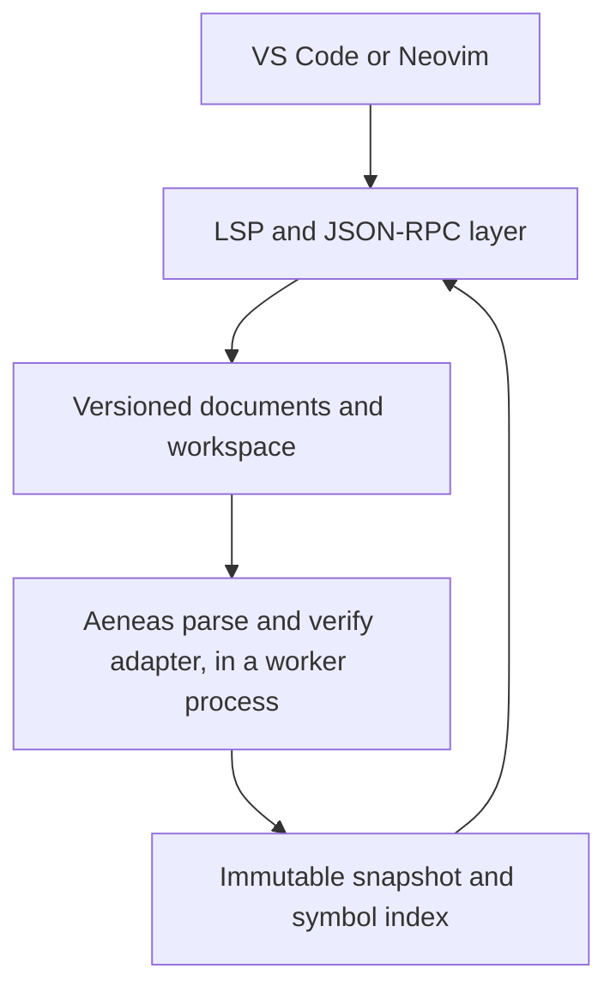

# Architecture

This document describes the intended structure of the server. Sections marked *planned* describe work in later milestones. See [ROADMAP.md](../ROADMAP.md) for the schedule.

## Overview



`virgil-lsp --stdio` communicates with the editor over standard input/output and owns the protocol layer, in-memory document overlays, and single-file parsing. The diagram includes planned workspace and semantic features. Whole-program analysis runs through the development `analyze` command and the unadvertised `virgil-lsp/analyze` stdio request; see [Analysis worker](#analysis-worker) for its process model. Editor integrations only launch the server and forward configuration.

## Source layout

| Directory | Responsibility | Status |
| --- | --- | --- |
| `src/main.v3` | Command-line entry point | Present |
| `src/worker/` | Analysis worker: its entry point (`WorkerMain.v3`), the supervisor that runs it, framing, and the message codec ([ADR-0004](decisions/0004-analysis-worker-process.md)) | Present |
| `src/os/<target>/` | System calls the Virgil `System` component lacks (pipes, process creation, polling), one file per target | Present for `x86-64-linux` and `x86-64-darwin` |
| `src/Log.v3` | Logging to standard error. Standard output is protocol-only. | Present |
| `src/analysis/` | **The only code that touches Aeneas.** Adapter, analysis snapshots, symbol indexes. | Adapter and server-owned snapshots present |
| `src/protocol/` | Byte framing, JSON-RPC message model, server request tracking, lifecycle state machine, document-sync and document-symbol handlers, parser diagnostic publication | Message model, framing, stdio transport, server request tracking, lifecycle, full-text sync, syntax outlines, and parser diagnostics present |
| `src/documents/` | URI normalization, versioned in-memory overlays with injected disk fallback, `PositionMap` | Present |
| `src/workspace/` | The `.virgil-lsp.json` parser and its configuration diagnostics; later, glob expansion, project contexts, scheduling | Parser present; the rest planned (M3) |
| `src/features/` | Semantic diagnostics, semantic symbols, definition, hover, and later features | Planned (M2–M5) |

## Build model

Virgil is a whole-program compiler. Every source file is passed to the compiler at once and shares one global namespace. The `virgil-lsp` executable is compiled from:

1. `src/main.v3` (passed first, because the first component with a `main` method becomes the entry point);
2. the rest of `src/`, except `src/worker/WorkerMain.v3` and the `src/os/` directories of other targets;
3. a generated `build/gen/BuildInfo.v3` with the version and revisions;
4. `vendor/virgil/aeneas/src/*/*.v3` and the libraries listed in `vendor/virgil/aeneas/DEPS`;
5. `vendor/virgil/lib/file/json/JsonParser.v3`, which the server uses but Aeneas does not.

Aeneas has its own `main`, but it comes later on the command line, so it isn't selected. Because all names share one namespace, server types must not reuse Aeneas top-level names ([ADR-0002](decisions/0002-pinned-virgil-adapter-boundary.md)).

`virgil-lsp-worker` is compiled from the same list with `src/worker/WorkerMain.v3` first instead of `src/main.v3`, and with its own heap size (see [ADR-0004](decisions/0004-analysis-worker-process.md#measurements)). The `Makefile` asks `scripts/v3c.sh -print-target` for the host target and adds `src/os/<target>/`. Virgil compiles only the code reachable from the entry point, so the server executable doesn't contain the verifier.

## Compiler adapter

The adapter (`src/analysis/AeneasAdapter.v3`) exposes compiler functionality in server-owned types:

- `parseFile(path, bytes)` runs Aeneas's single-file parser on in-memory bytes and returns `AnalysisDiagnostic`s and a declaration count. `AnalysisSingleFileParser` adapts the pinned `Parser.parseFile` driver with an adapter-local parser state and whitespace-skip observer. Current-token extraction records both byte endpoints using live parser coordinates, including hint names consumed without skipping. Retrospective `tokenAt` extraction uses the pinned implementation and does not register its recomputed columns in the diagnostic position map. Extraction is bounded by EOF, so an incomplete hint such as `class C #` reports a syntax error without trapping or adding bytes to the input. An adapter-local error sink captures the offsets when errors are emitted, including the current byte position for point errors. After an expression-start error at `...` or `..+`, it consumes the malformed operator as local recovery; the remaining malformed-range crash paths are listed in [Aeneas crash paths](aeneas-crash-paths.md). Grammar parsing stays in the unmodified compiler. *(present)*
- `documentSymbols(path, bytes)` is the syntax-outline adapter entry point. It shares `parseFile`'s parser driver and recovery (see [Document symbols](#document-symbols)). *(present)*
- `analyzeProgram(sources, collectStats)` runs in the [analysis worker](#analysis-worker) in product executables; adapter tests and probes also call it directly. It builds a fresh `Program` from in-memory `AnalysisSource`s and runs the shared `AnalysisSingleFileParser` with the program’s type cache, then `Compilation.verify()` if parsing succeeded, reusing one default-configured `Compiler`. It returns a `ProgramAnalysis` with diagnostics and timing; process-wide type-cache counts are collected only when requested (`--stats`), otherwise `globalTypesAdded` is -1. The adapter removes program-dependent global cache entries before returning, even on errors; `globalTypesAdded` counts retained builtin-only growth after this cleanup. Parse/verify timings exclude cleanup and diagnostic coordinate mapping. Diagnostics carry exact UTF-8 byte endpoints computed in the worker from captured sources by `AnalysisCoordinates`, which replays Aeneas's comment-column rules. The shared parser captures failed-parse endpoints directly and records every retrospective `tokenAt` span (`[]`, `[]=`, and `=>`). Those tokens retain compiler display columns while their internal ranges use live parser columns, so enclosing ranges remain unambiguous; diagnostic conversion restores display columns and uses the captured byte endpoints. Diagnostics without a source file retain null paths and -1 offsets. `AnalysisWire` protocol version 2 sends both offsets alongside compiler coordinates and charges their storage in the result decoder. Nothing is read from disk. Without a target, Aeneas supplies a synthetic `System` component, as it does for its interpreter. *(present; explicit disk sources plus overlays are accepted by the development request; automatic project selection remains M3)*
- `ProgramAnalysis.occurrences(path)` lazily walks each parsed file once after verification runs, including when semantic errors leave only partial bindings, and maps resolved `VarExpr` identifiers to source declarations (`AnalysisOccurrence`, `AnalysisDeclaration`). Unqualified match-case names are recorded as `VARIANT_CASE` or `ENUM_CASE` uses from verifier pattern metadata. Enum parameter fields are recorded as `FIELD` uses of the parameter declaration, following getter operators (including enum-type getter functions) or recovering the field from a verified enum-case receiver when a literal case argument was folded to a constant. Each resolved use is reported once, even when verification shares subtrees. Occurrence and declaration exports use the token’s original compiler coordinates, including retrospective `[]` and `[]=` tokens; live internal ranges are used for diagnostic mapping. Parsing failures return an empty array because verification did not run. Verification errors do not prevent collection of resolved uses; bindings with no source declaration, including null type bindings, are skipped. The source-ordered array is cached per file in that analysis; callers must not modify it. Paths are indexed once when the analysis is created. `definitionAt(path, line, column)` binary-searches the cached identifier ranges at a compiler position. *(present for `VarExpr`)* `AppExpr.appbind`, `NamedTypeRef.binding`, and expression types follow in M4.

Occurrence targets use source declarations rather than compiler-generated parameters or constructors: lambda captures follow their outer bindings (including nested captures), `this` resolves to the enclosing class, and default `.new` resolves to the class name. Explicit constructors still target their `new` declaration. Inline `export def` declarations have no separate use token and are omitted, including aliased declarations and declarations with semantic errors; separately named exports remain indexed.

The adapter never runs initializers, reachability analysis, or code generation.

`build/virgil-lsp analyze [--bindings] [--stats] [--repeat=n] <file.v3>...` exercises this path from the command line, through the analysis worker.

### Known constraints of the compiler front end

The M0 spike (issue #1) and retention investigation (issue #12) measured these. They shape the analysis snapshot design below. The detailed, extended inventory of known process-killing parse and verify inputs is in [Aeneas crash paths](aeneas-crash-paths.md).

- **Global type-cache retention is mitigated in the adapter.** `TypeCon.create` interns a composite type in the cache of a nested type's *constructor*, not in the cache that holds the nested type. Tuple, function, and array constructors are global, so types such as `(A, B) -> void` or `Array<(A, B)>` land in the process-wide `TypeUtil.globalCache` even when `A` and `B` are program classes. So does every composite type over an enum, because enum constructors also use the global cache. Without cleanup, each analysis of the Aeneas sources retains about 70 MB more, and the second analysis with the default 200 MB semispace heap fails with `HeapOverflow`. The adapter now removes these entries after parse/verify; builtin-only types remain interned.
- **The additional root was the initial cache bucket arrays, not a last-program field.** Virgil executes component initialization at compile time. The initial `TypeUtil.globalCache.singleBuckets` and `multiBuckets` arrays therefore live in the executable's data segment. `MachRtGcTables.recordRootObject` records every reference-array element as a permanent root; `NativeGlobalScanner.scanGlobals` scans those slots even after `TypeCache.rebalance` replaces the array. Rebalancing leaves stale bucket heads behind. Purging only the current arrays misses them. In the pinned Aeneas-source repro, one concrete path is an original `singleBuckets` element → `Array<(int, PackingBit)>` → `nested.head` (the tuple) → `nested.tail.head` (`PackingBit`'s `ClassType`) → `classDecl` → verified syntax and its connected type graph. The old multi-buckets also point at program-dependent function types (for example `(Array<byte>, int, T2) -> int` in the StringBuilder repro). These paths need not go through `Program`, and a small later analysis need not overwrite those slots. Clearing the original arrays as well as purging the current cache reduced the standalone Aeneas repro from 74,594,512 bytes live to 164,016 bytes (with source inputs no longer live).
- **The UID counter never resets.** `UID.next` is global, and type hashes are raw UIDs. Once it passes 2^29, non-generic class types look "open", and verification crashes with `TypeCheckException` in `Type.substitute()`. One analysis of the Aeneas sources uses about 32,500 UIDs, so the limit is about 16,500 such analyses per process. See the worker's [restart policy](decisions/0004-analysis-worker-process.md#restart-policy) for containment.
- **Parsing and verification can kill or hang the process.** See [Aeneas crash paths](aeneas-crash-paths.md) for the known inputs, trap sites, and containment limits. The adapter verifies only after a clean parse to avoid traps from truncated trees. Whole-program analysis runs in the [analysis worker](#analysis-worker), which contains these failures; single-file parsing still runs in the server.
- **Global options.** The parser and type system read `CLOptions` (language options such as `-lang:fun-exprs` and `-lang:legacy-infer`). The adapter uses the defaults. A project's [`compilerArgs`](configuration.md#compiler-flags) will mean setting this process-wide state before each of its analyses, and before single-file parsing of its documents. `AeneasAdapter.languageOptions()` supplies the pinned compiler's language options directly to `ProjectCompilerFlags` for validation.
- **At most 15 errors.** `Program.ERROR` is created with a limit of 15, and verification stops once it is reached.
- **Timing.** Parse plus verify takes about 0.1 ms for the two-file fixture and about 81 ms for the 198 Aeneas source files (80,285 lines) on an Intel Core i7-14700KF (`scripts/bench-analysis.sh 10`). Before source-declaration normalization, avoiding repeated walks of shared subtrees reduced the reported bindings to 159,815 (previously 161,300). Collection then took about 28 ms with a 1 GB heap, but 272 ms with the default 200 MB heap because of GC pressure. These are medians of 10 fresh-process runs of `analyze --stats --bindings` on the same Aeneas file set as the benchmark, with stdout redirected to `/dev/null`; the time is the `bindings in ... us` statistic, not report rendering. The executable before shared-subtree deduplication measured 28 ms and 380 ms respectively on the same machine. These measurements predate the analysis worker and ran in the `analyze` process. Analyses now run in the worker, whose heap `WORKER_HEAP` sets (for example `make WORKER_HEAP=1g`); [ADR-0004](decisions/0004-analysis-worker-process.md#measurements) has the measurements for that choice.

### Adapter retention workaround and regression probe

`src/analysis/AnalysisTypeCache.v3` detaches the initial bucket arrays on the first **runtime** whole-program analysis: it copies their entries into runtime-allocated arrays and clears the original permanent root slots. This must not run in a component initializer, which would merely create more static arrays. All later resized bucket arrays are ordinary collectible heap objects. After every parse/verify attempt, it unlinks entries whose constructors or nested types belong to a program, explicitly including enums and enum sets. Classification uses an iterative worklist and one memo shared across both bucket passes, so each distinct type is classified once without recursion; the memo is discarded after cleanup to avoid retaining program types. Unlinking also clears `Type.link` on removed entries; retained builtin types keep their identity. No vendor modification or forced GC is needed in production.

This is for serialized front-end-only analyses, not a general compiler reset. `ProgramAnalysis` still owns its verified VST while callers retain the snapshot. Cleanup does not mutate that tree; lazy binding queries remain valid after later analyses (covered by `AeneasAdapter:lazy_bindings_after_cache_cleanup`). The adapter never feeds a returned tree into more compiler phases, which might need the removed interning entries. Dropping the snapshot lets GC reclaim the tree. The UID counter, fatal traps, and peak memory needed to parse/verify are unchanged; the [analysis worker](#analysis-worker) contains them.

`make test` runs `test/analysis/RetainProbe.v3` in a **fresh process**, before the unit and transcript suites. It builds 128 classes with inferred generic calls and nested composite types, plus enums and shared nested builtin tuples. After each helper frame holding a snapshot has returned, it forces GC and requires live heap to be within 256 KiB of the pre-analysis baseline. It covers four successful analyses, verification errors, parse errors, and a later unrelated tiny program. Caller-owned input bytes stay live throughout. The allowance covers bounded cache bucket growth and builtin operator/type caches, not a retained program. In the original fixture, before shared-tuple coverage was added, removing just the initial-array detachment made the first check fail: 1,322,536 bytes live versus a 26,552-byte baseline, even with the current-cache purge still enabled. Shared-graph and deep-type cleanup also have dedicated regressions in `AeneasAdapter:shared_nested_tuple_cleanup` and `test/analysis/TypeDepthProbe.v3`; see [Tests](development.md#tests) for how to run them.

The same probe accepts source paths for larger measurements:

```sh
make BUILD=build/retain-large V3C='scripts/v3c.sh -heap-size=1g' build/retain-large/retain-probe
build/retain-large/retain-probe vendor/virgil/lib/util/StringBuilder.v3
build/retain-large/retain-probe vendor/virgil/lib/util/*.v3
AENEAS_DEPS=$(grep -v '^lib/test' vendor/virgil/aeneas/DEPS | awk '{print "vendor/virgil/" $0}')
build/retain-large/retain-probe vendor/virgil/aeneas/src/*/*.v3 $AENEAS_DEPS
```

Pinned x86-64-linux results (`RiGc.forceGC()` / `Semispace.fromSpaceUsed()`, bytes, source inputs kept live):

| Program | Before analysis | After dropping result | Added live heap |
| --- | ---: | ---: | ---: |
| Generated regression before shared-tuple coverage | 26,552 | 28,440 | 1,888 |
| StringBuilder alone (semantic errors) | 10,736 | 17,744 | 7,008 |
| `lib/util/*.v3` | 169,592 | 211,752 | 42,160 |
| Aeneas sources and dependencies (198 files) | 2,896,488 | 3,060,504 | 164,016 |

Each row stayed flat across four analyses. Eight CLI analyses of the Aeneas file set, run in the `analyze` process before the analysis worker existed, also completed with the **default 200 MB heap**, with no additional global types after the first run. These are post-GC live-heap measurements, not RSS or peak worker-memory requirements: a worker still needs room for the large active verified tree, temporaries, and both semispaces. Retaining several snapshots retains their trees intentionally.

## Coordinates

Aeneas reports one-based lines and one-based **display columns with tab expansion**. LSP uses zero-based lines and, by default, UTF-16 code-unit offsets with no tab expansion. The adapter retains compiler coordinates unchanged for CLI reporting; both single-file parser diagnostics and whole-program diagnostics additionally carry exact UTF-8 byte offsets (`beginOffset`, `endOffset`). Offsets are -1 only when no captured source is attached (in particular, program-level diagnostics with null paths). `PositionMap` (`src/documents/PositionMap.v3`) converts between UTF-8 byte offsets, compiler line/column pairs, and LSP positions for one document text. Subtracting one from a compiler column is wrong for tab-indented code. The unit test `AeneasAdapter:parse_tab_columns` records the current compiler behaviour.

The map is pure and takes compiler coordinates as plain ints. Its rules:

| | Compiler (Aeneas) | LSP 3.17 |
| --- | --- | --- |
| Base | One-based lines and columns | Zero-based lines and characters |
| Line ends | `\n` only. A `\r` is an ordinary byte with a column. | `\n`, `\r\n`, or `\r`, not part of the line |
| Columns or characters | One per byte, so a non-ASCII character takes one column per UTF-8 byte. A tab moves column *c* to 1 + ⌊(*c* + 8) / 8⌋ × 8, as `ParserState.column` does: the next stop of 9, 17, 25, …, except that from a multiple of 8 it skips a stop (8 → 17). | Code units of the position encoding: `utf-16` (default), `utf-8`, or `utf-32`. Invalid UTF-8 reads as U+FFFD, one per invalid sequence as in the WHATWG decoder: a byte that cannot start a sequence, or the longest valid prefix of an incomplete sequence. Each U+FFFD counts as 1 UTF-16 unit, 3 UTF-8 units, or 1 UTF-32 unit. |
| Out of range | A column past the line end is the line end. A column inside a tab's expansion is the tab. | A character past the line end is the line end. A line past the last line is the end of the document. |

A position inside a character (the middle of a surrogate pair or of a multi-byte UTF-8 sequence) maps to the start of that character, as does a byte offset inside a character or between the `\r` and `\n` of `\r\n`. Byte offsets are clamped to 0 through the text length inclusive (EOF). Compiler lines before 1 and LSP lines below 0 map to the document start; negative characters or columns map to the requested line's start. A compiler line past the last line maps to EOF. The position encoding is a parameter of the map, and `initialize` does not negotiate one yet.

Aeneas's pinned [`Parser.v3` `skipToNextToken`](https://github.com/titzer/virgil/blob/9945e4300bba2cd6d872c1a6f4ecfaa600f4be48/aeneas/src/vst/Parser.v3#L1444-L1511) counts every non-newline byte inside block comments (tabs included) as one column and does not advance columns inside line comments; newlines reset the column and advance the line. Consequently, reversing compiler columns with a context-free tab rule after a tab inside a block comment on the same line, or at EOF after a trailing line comment, is not exact. Single-file parser diagnostic ranges avoid that conversion: the analysis layer captures byte offsets while parsing, then the publication handler calls `PositionMap.offsetToPosition` for each endpoint. Whole-program diagnostics use the adapter-local `AnalysisCoordinates` replay map over captured UTF-8 source bytes. It stores sparse checkpoints at line boundaries, whitespace tabs, and line comments, bounds linear byte-column spans between them, and preserves literal bytes so comment markers inside strings or byte literals do not start comments. Nonempty range endpoints use the first offset at a coordinate, preserving a token end immediately before a line comment; an EOF point uses the actual source length, including a trailing comment. Failed-parse diagnostics use the shared parser’s direct captures, since `ParserState.advance1` can leave the last byte’s column at EOF. Retrospective `tokenAt` spans retain their byte endpoints during that same parse; their internal ranges use live columns and their diagnostic display columns are restored after mapping, covering enclosing expression ranges as well. Replay retains malformed literal failure spans so escaped quotes cannot trigger repeated scans of the same suffix. Both byte endpoints cross the worker boundary unchanged, ready for `PositionMap.offsetToPosition` in any supported LSP encoding; semantic diagnostic publication remains separate work. Declaration and occurrence ranges still carry compiler coordinates only; the replay helper is available for their later offset conversion. For `component C {\n/*\t*/ def x = ;\n}\n`, Aeneas reports the semicolon at 2:15, but its byte offset maps correctly to LSP 1:14. `PositionMap:analysis_block_comment_offsets` and adapter/protocol tests cover this path. The plain compiler-coordinate conversions still use the table's context-free tab rule; they are not used for parser diagnostic publication.

## Document store

`DocumentStore` (`src/documents/DocumentStore.v3`) owns open-document overlays, keyed by `DocumentUri.normalize(uri)`. It does no file I/O: its injected reader takes a decoded local absolute path and returns bytes, or `null` if unavailable. The stdio entry point injects `System.fileLoad` for ordinary reads and `AnalysisSourceFiles.load` for budgeted reads. `readBounded(uri, maxBytes)` enforces the development request's remaining source budget, including for overlays, without falling back to disk when an overlay is too large. Without an overlay, it requires the injected bounded reader; it returns `null` rather than using the ordinary reader when none is configured. `read(uri)` always returns the open overlay first, even when it is empty; otherwise it reads a local file afresh. Non-`file:` documents have no disk fallback. `overlay(uri)` returns only an open document's record (canonical URI, language ID, version, and text). Accepted changes replace records, so retained records preserve the version and text they captured; callers must treat their text bytes as read-only. Server-owned analysis snapshots record submission provenance and can test freshness against this store; publication consumers remain planned below.

The aggregate overlay capacity is **1,048,576 charged bytes (1 MiB)** (`DocumentLimits.MAX_BYTES`). Each open document charges its UTF-8 text, canonical URI, and language ID byte lengths, plus 256 bytes for its record, array headers/alignment, and map entry. This conservative per-record allowance also bounds the number of empty documents; the pinned map's bounded bucket table is a small fixed overhead. This is an admission budget, not an exact heap measurement or a promise of 1 MiB of text regardless of metadata. The limit is injected into the store constructor (smaller in boundary tests); stdio always uses the supported default.

`open` and `change` check the projected aggregate charge **before** inserting or replacing a record. Replacement subtracts the old record's charge, so same-size updates work at capacity; shrinking and closing release capacity. A rejected operation preserves every accepted overlay, including the previous text and version of the changed document, and does not consume a version or reserve capacity. There is no eviction. Only the final replacement in a validated full-text change batch is charged. Callers retaining old overlay records keep those snapshots alive outside this store's budget; the development analysis request copies accepted source bytes into a bounded worker frame and releases its source references after submission.

A capacity rejection is logged to stderr and sends an LSP `window/showMessage` notification with `MessageType.Warning` (2), identifying the ignored `didOpen` or `didChange` and asking the client to close documents or reduce text and retry. It is **not** a JSON-RPC error response: synchronization messages are notifications and have no response ID. The session continues, but a rejected open leaves the overlay absent: retry `didOpen` with text that fits after freeing capacity as needed; `didChange` cannot open it. A rejected change leaves the last accepted text and version: send a fitting full-text `didChange` with a version greater than the last accepted version (the rejected version may be reused), or close and reopen with text that fits. The warning makes this loss of synchronization visible instead of silently evicting accepted edits.

The capacity leaves headroom for [parsing the next message](#framing) within the default semispace heap's live budget. It is deliberately conservative relative to the measured worst-shape failure boundary, leaving most of that parsing margin for framing buffers, temporary replacement text, and fixed server state. Even when the store is full, the incoming message is parsed before admission, so the limit must leave this headroom rather than merely staying below the live-heap size. Larger heaps do not raise the supported overlay budget, and this bound does not cover future analysis caches or caller-retained snapshots.

`LspDocumentSync` (`src/protocol/LspDocumentSync.v3`) registers four notifications on the lifecycle's dispatcher. They run only while the server is running and never produce responses. Invalid parameters and rejected operations are ignored and logged through `Log.warn` to stderr in stdio mode; capacity rejections additionally emit the server notification described above.

| Notification | Effect |
| --- | --- |
| `textDocument/didOpen` | Records URI, language ID, integer version, and full text. A second open for an already-open canonical URI is ignored and logged, regardless of its version. Close first to restart a version sequence. |
| `textDocument/didChange` | Accepts only a version **greater than** the current version (gaps and negative initial versions are allowed). Equal, older, and out-of-order versions are ignored and logged, as are changes to unopened documents. Every content change must contain full text and no `range` or `rangeLength`; the whole batch is validated before changing anything. Only the final full replacement is stored after the entire batch passes validation. An empty batch is ignored and logged, without consuming its version. |
| `textDocument/didSave` | Validates that the document is open without changing its overlay record, text, or version, and does not read or write disk. Save requests no text (`includeText: false`); unsolicited string text is ignored because it has no version and must not overwrite an accepted edit. Save on a closed document is ignored and logged. |
| `textDocument/didClose` | Drops the overlay immediately, restoring disk fallback. Close on a closed document is ignored and logged. A subsequent open may start at any integer version. |

Malformed batches, duplicate opens, and stale changes never alter text or version. Full synchronization is advertised as `textDocumentSync: {openClose: true, change: 1, save: {includeText: false}}`; incremental synchronization and position-encoding negotiation are not advertised. See [Document symbols](#document-symbols) for outline support. Parser diagnostics are push notifications and need no capability advertisement.

### Parser diagnostics

Accepted opens and full-text changes synchronously run `AeneasAdapter.parseFile` on the retained overlay and send `textDocument/publishDiagnostics` for its canonical URI and version. Only the last replacement in a validated change batch is parsed. Each publication replaces the previous list, including an empty list when the parse is clean. Accepted closes publish an empty list with the last open version without reading the disk. Saves and rejected events never publish. Lifecycle admission also gates publication, so no diagnostics are sent before initialization or after shutdown.

Diagnostics include the Aeneas message, error code, `source: "aeneas"`, error severity, and a UTF-16 range derived from exact byte offsets, not compiler display columns. Aeneas point errors remain empty ranges, including at EOF. Non-file overlays are analyzed the same way as file overlays. See [Compiler adapter](#compiler-adapter) for parsing and recovery details and [Coordinates](#coordinates) for range conversion. This publication is syntax-only: automatic semantic analysis, workspace configuration, and scheduling remain later milestones. The stdio server starts an [analysis worker](#analysis-worker) only for the explicit development request; its results do not publish semantic diagnostics.

See [Stdio transport](#stdio-transport) for the notification sink and write-failure behavior.

### URI identity on Linux and macOS

`DocumentUri` is pure and uses POSIX paths on the [supported platforms](decisions/0003-supported-platforms.md):

- The `file:` scheme and the optional `localhost` authority are ASCII case-insensitive. Empty authority and `localhost` are equivalent: `file:/tmp/a`, `file:///tmp/a`, and `FILE://LOCALHOST/tmp/a` identify one document. Other file authorities are rejected rather than treated as local files. Paths must be absolute.
- Percent escapes are decoded **once**, with either hex case, into UTF-8 path bytes. Malformed escapes, NUL bytes, invalid UTF-8, and raw query/fragment delimiters are rejected. Literal `?`, `#`, and `%` in filenames must be escaped. Raw Unicode and spaces are accepted and canonicalized; `+` is a literal plus, never a space.
- Path normalization is lexical: repeated slashes, `.` and `..` segments, and trailing slashes are removed; parents above root stay at root. Encoded slashes and dots participate after decoding. Canonical keys are `file://` followed by the absolute path, retaining `/` and ASCII unreserved characters (`A–Z a–z 0–9 - . _ ~`) and encoding all other bytes with uppercase `%HH`.
- Path case and Unicode normalization are preserved, including on macOS. No `realpath`, symlink resolution, filesystem case folding, or inode lookup is performed. Lexical identity is not filesystem identity: symlink aliases and different case spellings on a case-insensitive filesystem are not coalesced, and clients should send lexically normalized paths rather than traversing symlinks with `..`.
- Non-`file:` URIs remain exact opaque keys: scheme case, escapes, queries, fragments, and dot segments are untouched. Empty/null URIs are rejected. Native Windows drive and UNC paths are not supported (WSL uses Linux file URIs).

For example, `file:///tmp/%61%20b.v3` and `file:/tmp/a b.v3` share the key `file:///tmp/a%20b.v3` and disk path `/tmp/a b.v3`. `untitled:a%20b` and `untitled:a b` remain distinct.

## Document symbols

`LspDocumentSymbols` handles `textDocument/documentSymbol` and advertises `documentSymbolProvider: true`. It returns hierarchical `DocumentSymbol[]` from the requested open document's current overlay, without reading disk or running semantic verification. Malformed parameters receive `InvalidParams`; a closed/unopened document or any parse failure returns `[]`, never a stale or truncated outline.

The analysis layer walks VST declarations in source order: components are namespaces, classes are classes, enums are enums (with enum-member children), layouts and packings are structs, methods are methods, constructors are constructors, and fields are fields. Class/enum header parameters are field children. File-scope methods and fields appear at the root rather than under the compiler's synthetic component. Compiler-generated tag/name members are omitted. Method locals and parameters are not outline symbols.

The VST does not store complete declaration ranges. `SymbolSyntaxIndex` records the parser's consumption spans **before** it skips whitespace and comments, associates VST name tokens with those spans, and balances consumed single-byte delimiters to find declaration ends. Strings, comments, and composite operators such as `[]` and `[]=` cannot introduce false delimiters. `range` includes modifiers and excludes trailing whitespace/comments. Body declarations include their final brace; semicolon-terminated declarations include their semicolon, including expression-bodied methods with nested function bodies. Comma-separated fields share their statement range. Class/enum header fields include `var` when present and stop before the separating comma or closing parenthesis; enum-member ranges include their argument lists when present. `selectionRange` selects each declaration's name. The adapter returns server-owned symbols with UTF-8 byte offsets; the protocol converts both ranges through `PositionMap` with UTF-16 positions. This also avoids the compiler's same-line block-comment tab column anomaly. CRLF and bare CR are normalized only in parser input, preserving byte offsets and leaving the overlay unchanged.

The outline parses through `AnalysisSingleFileParser`, the same driver as [`parseFile`](#compiler-adapter); its skip observer feeds both the diagnostic position map and `SymbolSyntaxIndex`. Both share recovery for a trailing `#` (bounded token extraction) and expression-start `...` or `..+` (local recovery), which return `[]` from the outline as parse failures. Only the outline normalizes CRs: row 24's CRLF prefix therefore does not exhaust the error limit, allowing recovery to return `[]`; `parseFile` still crashes. Deep nesting (row 13) and malformed ranges in rows 20–23 still kill the server through either entry point; see [Aeneas crash paths](aeneas-crash-paths.md).

Golden transcripts and handler-level unit tests cover all supported declaration kinds, nested bodies, exact ranges, unsaved replacements, parse failure/recovery (including malformed ranges typed one keystroke at a time), URI aliases, lifecycle/parameter errors, and UTF-16 positions.

## Project files *(partly present)*

[Configuration](configuration.md) specifies the `.virgil-lsp.json` format, and [ADR-0005](decisions/0005-project-file-format.md) records its design. `src/workspace/` holds the parser, which does no file-system access:

- `ProjectJsonParser` (`ProjectJson.v3`) parses the file into `ProjectJson` values that record their UTF-8 byte ranges and keep object members in order, including repeated keys. It extends `JsonRpcJsonParser`, so string escapes, numbers, and the nesting and value limits are those of [JSON-RPC messages](#json-limitations-and-workarounds).
- `ProjectConfigParser.parse(bytes)` (`ProjectConfig.v3`) checks the values against version 1. It returns a `ProjectConfig` model, or `ProjectConfigDiagnostic`s with codes and byte ranges, but never both. `ProjectPatterns` checks pattern syntax, and `ProjectCompilerFlags` checks `compilerArgs` against the language options.

*(planned)* Finding the project file for a document, expanding its patterns, choosing active projects, publishing configuration diagnostics on the project file's URI, and applying `compilerArgs` ([#55](https://github.com/SaltedTan/virgil-language-server/issues/55), [#58](https://github.com/SaltedTan/virgil-language-server/issues/58)).

## Analysis worker

[ADR-0004](decisions/0004-analysis-worker-process.md) owns the process model, IPC contract, restart policy, and heap measurements. `AnalysisSupervisor` (`src/worker/AnalysisSupervisor.v3`) decodes worker results into an `AnalysisSnapshot`; see [Analysis snapshots](#analysis-snapshots-partly-present) for the server-owned representation.

The development `analyze` command and the stdio server share the supervisor's asynchronous startup/analysis state machine. **Option 2a** is the pre-M3 trigger: the unadvertised `virgil-lsp/analyze` request submits an explicit set of URIs. [Development stdio requests](development.md#development-stdio-requests) owns submission, completion, and lifecycle behavior.

`virgil-lsp/snapshot` is an unadvertised read-only inspection request for the retained snapshot, including during a hang or after a crash. This proves server-owned results remain usable without a live worker; see [Analysis snapshots](#analysis-snapshots-partly-present) for freshness. [Development stdio requests](development.md#development-stdio-requests) owns the formats, limits, and errors. The [interactive protocol transcripts](../test/protocol/worker.py) check concurrent responses during startup and a hanging analysis, crash recovery, fragmented stdin at timeout, lifecycle cleanup, and 20 Aeneas analyses across routine replacements.

## Analysis snapshots *(partly present)*

`AnalysisSnapshot` (`src/analysis/AnalysisSnapshot.v3`) is the server-owned result of one analysis: diagnostics, the distinct declarations, each file's occurrences (as ranges and declaration indexes in int arrays), and the worker's measurements. It answers `occurrences` and `definitionAt` like `ProgramAnalysis` but references no compiler object, so it outlives the worker that produced it. *(present)*

For stdio submissions, `LspDevelopmentAnalysis` captures each source's canonical URI and overlay version or disk provenance alongside the bytes, keeps that record outside the worker protocol, and attaches it to the completed snapshot before replying. `AnalysisSnapshot.matchesDocument(store, uri)` normalizes the query URI and returns false for absent/unrecorded sources. Overlay stamps require the same accepted document record: any accepted change or close invalidates them, including close/reopen with the same version number. Rejected changes, duplicate opens, and saves leave freshness unchanged. A lightweight identity token avoids retaining overlay text. Disk stamps are **assumed current while no overlay exists**; opening an overlay makes them stale, and closing it restores assumed freshness. External disk changes, deletion, size, and modification time are not tracked. Freshness is per-source, not a claim that the whole program's dependencies are current. Raw worker/CLI snapshots have no document-store provenance and the helper returns false for them. The development inspection API reports the stamps and per-source freshness; see [Development stdio requests](development.md#development-stdio-requests). [AnalysisDocumentVersionsTest](../test/unit/AnalysisDocumentVersionsTest.v3) covers changes and closes while pending, version reuse, rejected events, and the disk policy. *(present)*

*(planned)* Each snapshot will also record the configuration revision (once project configuration exists in #53) and a type/signature display cache. Handlers read the newest snapshot that matches the request's document versions. A result computed from document version *n* is never published after version *n + 1* has been accepted. When a new edit breaks parsing, navigation keeps using the last good semantic snapshot while current syntax errors are published.

## JSON-RPC messages

`src/protocol/` models JSON-RPC 2.0 messages. It works on the JSON payload of one message and does no I/O. [Framing](#framing) splits the input stream into payloads.

| File | Contents |
| --- | --- |
| `JsonRpcMessage.v3` | `JsonRpcMessage` with four distinct shapes: `Request`, `Notification`, `Response`, `ErrorResponse`. `JsonRpcId` (`Int`, `String`, or `Null`, which only error responses use). `JsonRpcParams` (`Absent`, `Null`, `ByName`, `ByPosition`). `JsonRpcError` and the standard error codes. Encoding. |
| `JsonRpcDecoder.v3` | Decodes and validates a payload into `JsonRpcInput`: `Valid`, `Rejected` (answered with an error), or `Dropped`. |
| `JsonRpcDispatcher.v3` | Routes requests and notifications to handlers by method name, and responses to the pending-request table. Returns the reply payload, if any. |
| `JsonRpcPendingRequests.v3` | The requests the server has sent to the client, matched to their responses (see below). |
| `JsonRpcJson.v3` | JSON parsing and rendering on top of Virgil's `lib/file/json` (see below). |
| `LspServer.v3` | The [lifecycle](#lifecycle) in front of the dispatcher, implemented capabilities, and the LSP error codes it uses. |
| `LspDocumentSync.v3` | Validates full-text synchronization notifications and updates the [document store](#document-store). |
| `LspDocumentSymbols.v3` | Reads the current open overlay, requests syntax symbols from the analysis adapter, and converts byte ranges with `PositionMap`. |
| `LspParserDiagnostics.v3` | Publishes [parser diagnostics](#parser-diagnostics) for accepted overlays and clears them on close. |
| `LspDevelopmentAnalysis.v3` | Unadvertised analysis submission, deferred completion, lifecycle cancellation, and retained-snapshot inspection. |

The decoder checks each member for presence and type before reading it. A missing `HashMap` key returns a default `JsonValue` instead of failing, and a failed cast ends the process. Once the [lifecycle](#lifecycle) has admitted a message, it is handled as follows:

| Input | Reply |
| --- | --- |
| Request with a registered method | The handler's result or error, with the original `id`; `onDeferredRequest` handlers send it later through an injected sink |
| Request with an unknown method | `MethodNotFound` (-32601), with the original `id` |
| Notification, known or unknown | None. Unknown notifications are ignored. |
| Response or error response | None. It completes the server request with the same `id`, if one is outstanding, and is otherwise ignored. Malformed responses are dropped, because answering a response could start a loop of error replies. |
| Payload that is not valid JSON | `ParseError` (-32700), `id` null |
| Valid JSON that is not a valid request or notification | `InvalidRequest` (-32600), with the original `id` if it was valid and null otherwise |

A message is an invalid request if it isn't an object (this includes batches, which LSP doesn't use), its `jsonrpc` isn't `"2.0"`, its `method` is missing or not a string, its `id` isn't an integer or a string, its `params` isn't an object, an array, or null, or it has a `result` or `error` next to a `method`. Following JSON-RPC 2.0, it is answered even if it has no `id`.

String IDs are echoed as the same string value. Escapes are decoded on input and re-encoded on output, so `"\u0041"` comes back as `"A"`.

### Server requests

The server will need to send requests to the client, such as `workspace/configuration` or `client/registerCapability`, and match the client's responses to them. The server is single-threaded, so a handler can't wait for a response. Instead, `JsonRpcPendingRequests` keeps a callback for each outstanding request, which runs when the request completes and receives the result or the error as a `JsonRpcReply`. The dispatcher owns the table (`pending`) and passes every decoded response to it. Like the dispatcher, the table does no I/O: `send(method, params, onComplete)` records the request and returns its encoded payload, which the caller frames and writes.

- Requests get integer IDs counting up from 1, skipping any ID that is still outstanding, so no two outstanding requests share an ID. After the largest 32-bit integer, the count starts again at 1.
- A response or error response whose `id` matches an outstanding request completes it exactly once and removes it from the table, before the callback runs, so the callback may send further requests.
- A response with an unknown or already-completed `id` (including a string `id`, since the server sends only integers), or an error response with a null `id`, completes nothing and is not answered. `complete` returns the reason, and the dispatcher passes it to its `onIgnoredResponse` handler. `--stdio` logs it to stderr as a warning.
- A decoded response or error response marked `JsonRpcInput.Valid(_, true)` completes its matching request with `InternalError` (-32603), so the callback never sees the null placeholders for numbers that aren't 32-bit integers (see [Numbers](#json-limitations-and-workarounds)). Malformed responses are still dropped without completing a request.
- `failAll(error)` visits the requests outstanding when it starts and completes each with `error` unless an earlier callback already completed it. Requests sent by the callbacks it runs stay outstanding, even if they reuse an original request's ID. The `JsonRpcPendingRequests:fail_all_reentrant` and `JsonRpcPendingRequests:fail_all_recycled_ids` unit tests cover these cases.

Requests the client never answers stay outstanding until `failAll`; there is no timeout yet. A successful `shutdown`, `exit`, and the end of the input each call `failAll` with `RequestCancelled` (-32800), using the completion contract above. No server request is sent yet.

### JSON limitations and workarounds

The pinned `lib/file/json` differs from RFC 8259 in ways that matter for LSP traffic. `JsonRpcJson.v3` works around each one. The unit tests `JsonRpcJson:upstream_*` record the upstream behaviour, so a Virgil update that changes it is noticed.

- **String escapes.** `JsonParser` keeps escapes undecoded and rejects `\/`, `\b`, `\f`, and `\uXXXX`. Clients do send these: for example, `JSON.stringify` in VS Code writes control characters in document text as `\u00XX`. `JsonRpcJsonParser` overrides `parseString` to decode all JSON escapes, combining surrogate pairs. A lone surrogate becomes U+FFFD, which is also one UTF-16 code unit, so LSP character offsets don't shift.
- **Whitespace.** A carriage return counts as whitespace.
- **Numbers.** `JsonValue` has no floating point and only 32-bit integers. `parseNumber` accepts the full JSON number grammar. Any number that isn't a 32-bit integer (fractions, exponents, out of range) becomes null and is counted. As an `id`, such a number gives `InvalidRequest` with a null `id`. Elsewhere in a request admitted by the [lifecycle](#lifecycle), the request gets `InvalidParams` (-32602) with its original `id`, or `MethodNotFound` if the method is unknown. Its handler never runs, so it never sees the replaced values. The dispatcher ignores notifications with such a number; document-sync notifications admitted by the lifecycle also log a warning without reading the replaced params. Lifecycle admission and the `exit` exception are described in [Lifecycle](#lifecycle). Apart from the `decimal` colour values of `textDocument/colorPresentation`, which the server doesn't support, LSP 3.17 has no fractional numbers sent by the client, and its integers fit in 32 bits. Free-form `LSPAny` values such as `initializationOptions` could still contain one, and would make that request fail.
- **Nesting.** The recursive-descent parser overflows the stack, which kills the process. In a probe of the pinned parser, 30,000 levels of nesting still parsed and 50,000 crashed. Input that nests arrays and objects more than 256 levels deep is rejected as a `ParseError` before parsing starts.
- **Size.** The parser builds the whole tree on the heap, and running out of heap kills the process. The byte limit on messages doesn't bound that: a 10 MB array of five million zeros needed more than the default 200 MB heap. The cost per value depends on its shape. Measured with the pinned build, an integer costs about 60 bytes, an empty string or array about 85, and an empty object about 185, including the parser's temporary vectors. A message with more than 50,000 values (`JsonRpcJson.MAX_VALUES`, counting object keys) is rejected as a `ParseError` before parsing starts. This keeps the measured per-value allocation allowance below about 10 MB, alongside the [payload byte limit](#framing), leaving headroom for worker input and retained snapshots. The same allocation-free pre-scan, `JsonRpcJson.measure`, counts values and measures nesting. Strings count as one value each; their bytes are bounded by the message limit. See [Framing](#framing) for the supported payload limit and memory budget.
- **Rendering.** `JsonValue.render` writes Virgil string literals: it escapes `'` as `\'` and leaves control characters raw, which produces invalid JSON. `JsonRpcJson.render` escapes quotes, backslashes, and all control characters, and replaces bytes that aren't valid UTF-8 with `\ufffd`, so output is always valid JSON. Output is compact, and object members are sorted by key, so it's deterministic.

## Framing

`LspFrameReader` (`src/protocol/LspFrameReader.v3`) splits the client's byte stream into message payloads, following the LSP base protocol: header fields of the form `Name: value`, each ending with CR LF, then an empty line, then exactly `Content-Length` bytes of payload. Like the dispatcher, it does no I/O. The caller feeds in bytes in chunks of any size and takes out frames, and the way the input is split into chunks never changes the frames. The unit tests feed every input in several chunk sizes, down to one byte at a time, to check this.

- `Content-Length` counts bytes, not characters, and is required. Field names are case-insensitive. Spaces and tabs around a value are ignored, and unknown fields are ignored.
- `Content-Type` is optional. Its media type isn't checked, but a `charset` parameter must be `utf-8` (or `utf8`, which LSP accepts for backward compatibility), compared case-insensitively. Parameters are split at semicolons outside quoted strings, as in HTTP, so a quoted value of another parameter can contain `;` or `charset=` without being read as the charset. Within a quoted string, a backslash escapes the following byte, including a quote or another backslash. A charset value enclosed in a complete quoted string has its enclosing quotes removed and backslash escapes undone.
- The payload limit is set when the reader is created: `virgil-lsp --stdio --max-message-bytes=<n>`, or `LspFraming.DEFAULT_MAX_PAYLOAD` (4 MiB) by default. The header may be at most `LspFraming.MAX_HEADER_BYTES` (8 KiB) long.
- A payload within the limit is buffered as its bytes arrive, so a header alone never allocates the length it declares. If the input ends first, the transport reports that it ended in the middle of a message.
- While finding a header, `feed` stages up to `LspFraming.MAX_HEADER_BYTES` of input, which can include body bytes. After identifying the current body, it copies further accepted bytes directly into the payload and discards further skipped bytes without copying them. Input after a complete frame is staged until `next` returns that frame and advances through the remaining input; this can include an entire following skipped body. When advancing a frame leaves at most a header's worth of unread input, a staging buffer larger than the header limit shrinks to at most that limit. Chunks have no fixed API size limit, but peak staging memory depends on their size and buffer growth. To bound it, callers must limit chunk sizes and drain `next` until `Incomplete` before feeding another chunk, stopping on `Malformed`, as the [stdio transport](#stdio-transport) does. Without draining, unread input can accumulate across chunks. The regressions `LspFrameReader:large_skipped_chunk` and `LspFrameReader:large_chunk_after_message` in [the unit tests](../test/unit/LspFrameReaderTest.v3) cover allocation, retention, and preservation of a following frame.
- `--max-message-bytes` accepts positive decimal byte counts up to `LspFraming.MAX_SUPPORTED_PAYLOAD`, 4,194,304 bytes (4 MiB), the same as the default. A higher value is rejected with exit status 2 before reading input, even with a larger heap. A complete message is parsed in full, and its parsed form takes several times its length. Historical measurements with the pinned build and the default 200 MB semispace heap (100 MB live) found a failure boundary around 17.3 MiB for nearly 500,000 values, mostly empty objects plus padding. Those former limits left insufficient room for concurrent analysis state. The payload limit now works with the [JSON value limit](#json-limitations-and-workarounds), [development source budget](development.md#development-stdio-requests), and [worker decoder allocation budget](decisions/0004-analysis-worker-process.md#consequences). Replacement can keep both the old and new snapshots live, plus a raw worker frame up to the [IPC frame limit](decisions/0004-analysis-worker-process.md#channel-and-framing) and an incomplete client frame. The [interactive worker transcripts](../test/protocol/worker.py) exercise these overlaps.
- **Retained overlays.** See [Document store](#document-store) for the aggregate admission budget and how it preserves parsing headroom.

Each call returns one frame:

| Frame | When | Stream |
| --- | --- | --- |
| `Message(payload)` | A complete message | Continues |
| `Incomplete` | More input is needed | Continues |
| `Skipped(reason)` | The payload is longer than the limit or not UTF-8. It is discarded under the buffering rules above. | Continues: the length was known, so the next message is found |
| `Malformed(reason)` | The header has no valid `Content-Length`, repeats `Content-Length` or `Content-Type`, has a line without a colon, an invalid field name, a CR or LF outside a CR LF pair, a byte that isn't printable ASCII, a space, or a tab, or is longer than the header limit | Ends: without a length, the start of the next message can't be found. Every later call returns the same frame. |

Header bytes are checked as they arrive, so a header fails as soon as the byte that proves it bad comes in, and doesn't wait for a header end that may never come. That covers a byte that can't appear in a header (for example bare JSON with non-ASCII text), an LF without a CR before it, and a CR followed by anything but LF. A CR at the end of the input waits for the next byte. Header lines must end with CR LF; a lone LF is malformed, as the specification requires. `midMessage()` reports whether part of a message has been read, so that the end of the input can be told apart from a message cut short.

### Stdio transport

`LspTransport` (`src/protocol/LspTransport.v3`) connects the frame reader to a message handler, which for `--stdio` is the [lifecycle](#lifecycle) in front of the dispatcher: each payload is handled, and each returned reply or server notification is written by `LspFrameWriter` as one framed message. Once the handler reports that it has finished, after `exit`, the transport reads no more messages. The writer builds the header and payload in one buffer and keeps writing until all of it is out, because a write to a pipe may take only part of it. The transport does no I/O itself: `--stdio` polls stdin and worker pipes together against the supervisor's current startup/analysis deadline. It reads ready stdin in chunks of up to 64 KiB, passes them in, and advances worker I/O each turn, even under continuous client input. Incomplete client frames do not block worker completion or timeout. The transport's stdout writer remains synchronous; a client that stops reading can still apply output backpressure. Unit tests drive it with input in small chunks and a writer that takes a few bytes at a time.

Parser diagnostic publications and deferred analysis responses use `LspServer.sendNotification` (the shared outgoing-message sink), which the stdio entry point binds to `LspTransport.send`. This sink shares the frame writer and failure path with returned messages; unit tests can inject a recording sink instead. Capacity warnings still arrive as `handle`'s returned payload.

| Event | Effect | Exit status |
| --- | --- | --- |
| A message is skipped | A warning on stderr. No reply, because the payload wasn't read, so it isn't known whether it was a request. | Continues |
| A header is malformed | An error on stderr. Output from earlier messages has been sent. Nothing after the header is read. | 1 |
| An outgoing message can't be written | An error on stderr | 1 |
| The input ends in the middle of a message | An error on stderr | 1 |
| The `exit` notification is handled | Nothing after it is read, even input already received | See [Lifecycle](#lifecycle) |
| The input ends between messages | — | See [Lifecycle](#lifecycle) |

## Lifecycle

`LspServer` (`src/protocol/LspServer.v3`) follows the lifecycle of the [LSP 3.17 specification](https://microsoft.github.io/language-server-protocol/specifications/lsp/3.17/specification/#lifeCycleMessages). It checks each request and notification against the lifecycle state before the dispatcher routes it. Payloads that aren't valid requests or notifications get their `ParseError` or `InvalidRequest` in every state, and responses from the client go to the [pending-request table](#server-requests) in every state, until `exit`.

| State | Request | Notification | Next state |
| --- | --- | --- | --- |
| Uninitialized | `initialize` is handled. Any other request gets `ServerNotInitialized` (-32002), even an unknown method. | `exit` is handled. Others, including `initialized`, are dropped. | Running, once `initialize` succeeds |
| Running | A second `initialize` gets `InvalidRequest` (-32600). `shutdown` returns `null`. Other requests are dispatched. | `initialized` is accepted and does nothing. Others are dispatched. | Shutting down, after `shutdown` |
| Shutting down | Every request gets `InvalidRequest`, including `shutdown` and `initialize`. | `exit` is handled. Others are dropped. | — |
| Exited | Nothing is read. | Nothing is read. | — |

Once decoded as a valid request, `initialize` needs an object as its params; otherwise it gets `InvalidParams` (-32602) and the server stays uninitialized, so the client may try again. The [number restrictions](#json-limitations-and-workarounds) also apply; no client capability or other param field changes the server's behavior yet. The result advertises the capabilities described under [Document store](#document-store) and [Document symbols](#document-symbols), and contains `serverInfo` with `name` and `version` from the generated `BuildInfo` (see [Build model](#build-model)). The version comes from the repository's `VERSION` file and is also reported by `--version`.

`exit` ends the session in any state. So does the end of the input, which is how a client process that disappears looks to the server. Either way, outstanding server requests are failed, and the process exits:

| How the session ends | Exit status | stderr |
| --- | --- | --- |
| `exit` after a successful `shutdown` | 0 | — |
| `exit` without a successful `shutdown` | 1 | An error |
| The input ends after a successful `shutdown` | 0 | — |
| The input ends without a successful `shutdown` | 1 | An error |
| The transport fails (see the [stdio transport](#stdio-transport)) | 1 | An error |

The end of the input is treated like `exit` because a client that sent `shutdown` has asked the server to stop and has nothing more to send, while one that disappears without it ended the session abnormally. The server doesn't watch the client's `processId`.

`exit` is handled before its params are read, so params the server can't read (see [Numbers](#json-limitations-and-workarounds)) don't stop it. The transport reads nothing after `exit`, so later messages get no reply, even if they arrived in the same read.

### Cancellation

Once decoded as a valid notification, `$/cancelRequest` is ignored and never gets a response, regardless of the contents of its params. Malformed envelopes follow the [JSON-RPC validation contract](#json-rpc-messages). Before `initialize` and after `shutdown` it is dropped like other notifications. A request with the method `$/cancelRequest` is unregistered and follows the request rules in the lifecycle table above. Pending development analyses are cancelled only at shutdown, exit, or EOF; these lifecycle transitions kill/reap the worker, reply to the original request with `RequestCancelled` (-32800), and preserve the last snapshot.

## Protocol invariants

- Each incoming request receives at most one response, carrying the request's original `id` (integer or string). [Skipped](#framing) messages and input after `exit` aren't read, so they get none; a [transport failure](#stdio-transport) may prevent delivery of a complete response. *(present)*
- Notifications never receive a response. Unknown notifications are ignored. Request errors depend on the [lifecycle state](#lifecycle). *(present)*
- `Content-Length` counts bytes. Reads may be partial and messages may be fragmented. Messages above a size limit are skipped. *(present)*
- Standard output carries protocol bytes only. *(present; the [transcripts](../test/protocol/) compare it byte for byte)*
- Advertised capabilities exactly match implemented handlers. *(present: full-text document synchronization with open/close and save, and document symbols)*
