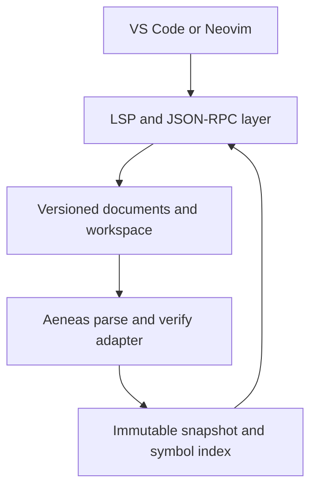

# Architecture

This document describes the intended structure of the server. Sections marked *planned* describe work in later milestones. See [ROADMAP.md](../ROADMAP.md) for the schedule.

## Overview

`virgil-lsp` is one process that communicates with the editor over standard input/output. It owns the protocol layer, the in-memory document overlays, the compiler front end, and the semantic index. Editor integrations only launch the process and forward configuration.

## Source layout

| Directory | Responsibility | Status |
| --- | --- | --- |
| `src/main.v3` | Command-line entry point | Present |
| `src/Log.v3` | Logging to standard error. Standard output is protocol-only. | Present |
| `src/analysis/` | **The only code that touches Aeneas.** Adapter, analysis snapshots, symbol indexes. | Adapter spike present |
| `src/protocol/` | Byte framing, JSON-RPC message model, lifecycle state machine | Planned (M1) |
| `src/documents/` | URIs, versioned text, `PositionMap` | Planned (M2) |
| `src/workspace/` | `.virgil-lsp.json`, glob expansion, project contexts, scheduling | Planned (M3) |
| `src/features/` | Diagnostics, symbols, definition, hover, and later features | Planned (M2–M5) |

## Build model

Virgil is a whole-program compiler. Every source file is passed to the compiler at once and shares one global namespace. The `virgil-lsp` executable is compiled from:

1. `src/main.v3` (passed first, because the first component with a `main` method becomes the entry point);
2. the rest of `src/`;
3. a generated `build/gen/BuildInfo.v3` with the version and revisions;
4. `vendor/virgil/aeneas/src/*/*.v3` and the libraries listed in `vendor/virgil/aeneas/DEPS`.

Aeneas has its own `main`, but it comes later on the command line, so it isn't selected. Because all names share one namespace, server types must not reuse Aeneas top-level names ([ADR-0002](decisions/0002-pinned-virgil-adapter-boundary.md)).

## Compiler adapter

The adapter (`src/analysis/AeneasAdapter.v3`) exposes compiler functionality in server-owned types:

- `parseFile(path, bytes)` runs `Parser.parseFile` on in-memory bytes and returns `AnalysisDiagnostic`s and a declaration count. *(present)*
- Whole-program analysis builds a fresh `Program` from disk sources plus open overlays, then runs `Compilation.parse()` and `Compilation.verify()` only. *(planned, M3)*
- Binding queries walk the verified VST for `VarExpr.varbind`, `AppExpr.appbind`, `NamedTypeRef.binding`, and expression types. *(planned, M4)*

The adapter never runs initializers, reachability analysis, or code generation.

## Coordinates

Aeneas reports one-based lines and one-based **display columns with tab expansion**. LSP uses zero-based lines and, by default, UTF-16 code-unit offsets with no tab expansion. The adapter returns compiler coordinates unchanged. A dedicated `PositionMap` per document converts between UTF-8 byte offsets, compiler line/column pairs, and negotiated LSP positions. Subtracting one from a compiler column is wrong for tab-indented code. The unit test `AeneasAdapter:parse_tab_columns` records the current compiler behaviour.

## Analysis snapshots *(planned)*

Each analysis produces an immutable snapshot containing: the configuration revision, the document versions it used, the `Program` and verified VST, diagnostics grouped by URI, declaration and occurrence indexes, and a type/signature display cache. Handlers read the newest snapshot that matches the request's document versions. A result computed from document version *n* is never published after version *n + 1* has been accepted. When a new edit breaks parsing, navigation keeps using the last good semantic snapshot while current syntax errors are published.

## Protocol invariants *(planned, M1)*

- Each request receives exactly one response, carrying the request's original `id` (integer or string).
- Notifications never receive a response. Unknown notifications are ignored. Unknown requests receive `MethodNotFound`.
- `Content-Length` counts bytes. Reads may be partial and messages may be fragmented. Messages above a size limit are rejected.
- Standard output carries protocol bytes only.
- Advertised capabilities exactly match implemented handlers.
