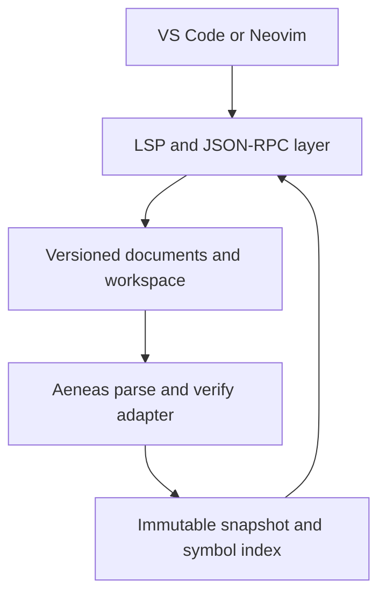

# Architecture

This document describes the intended structure of the server. Sections marked *planned* describe work in later milestones. See [ROADMAP.md](../ROADMAP.md) for the schedule.

## Overview

`virgil-lsp` is one process that communicates with the editor over standard input/output. It owns the protocol layer, the in-memory document overlays, the compiler front end, and the semantic index. Editor integrations only launch the process and forward configuration.

## Source layout

| Directory | Responsibility | Status |
| --- | --- | --- |
| `src/main.v3` | Command-line entry point | Present |
| `src/Log.v3` | Logging to standard error. Standard output is protocol-only. | Present |
| `src/analysis/` | **The only code that touches Aeneas.** Adapter, analysis snapshots, symbol indexes. | Adapter spike present |
| `src/protocol/` | Byte framing, JSON-RPC message model, lifecycle state machine | Message model present; framing and lifecycle planned (M1) |
| `src/documents/` | URIs, versioned text, `PositionMap` | Planned (M2) |
| `src/workspace/` | `.virgil-lsp.json`, glob expansion, project contexts, scheduling | Planned (M3) |
| `src/features/` | Diagnostics, symbols, definition, hover, and later features | Planned (M2–M5) |

## Build model

Virgil is a whole-program compiler. Every source file is passed to the compiler at once and shares one global namespace. The `virgil-lsp` executable is compiled from:

1. `src/main.v3` (passed first, because the first component with a `main` method becomes the entry point);
2. the rest of `src/`;
3. a generated `build/gen/BuildInfo.v3` with the version and revisions;
4. `vendor/virgil/aeneas/src/*/*.v3` and the libraries listed in `vendor/virgil/aeneas/DEPS`;
5. `vendor/virgil/lib/file/json/JsonParser.v3`, which the server uses but Aeneas does not.

Aeneas has its own `main`, but it comes later on the command line, so it isn't selected. Because all names share one namespace, server types must not reuse Aeneas top-level names ([ADR-0002](decisions/0002-pinned-virgil-adapter-boundary.md)).

## Compiler adapter

The adapter (`src/analysis/AeneasAdapter.v3`) exposes compiler functionality in server-owned types:

- `parseFile(path, bytes)` runs `Parser.parseFile` on in-memory bytes and returns `AnalysisDiagnostic`s and a declaration count. *(present)*
- Whole-program analysis builds a fresh `Program` from disk sources plus open overlays, then runs `Compilation.parse()` and `Compilation.verify()` only. *(planned, M3)*
- Binding queries walk the verified VST for `VarExpr.varbind`, `AppExpr.appbind`, `NamedTypeRef.binding`, and expression types. *(planned, M4)*

The adapter never runs initializers, reachability analysis, or code generation.

## Coordinates

Aeneas reports one-based lines and one-based **display columns with tab expansion**. LSP uses zero-based lines and, by default, UTF-16 code-unit offsets with no tab expansion. The adapter returns compiler coordinates unchanged. A dedicated `PositionMap` per document converts between UTF-8 byte offsets, compiler line/column pairs, and negotiated LSP positions. Subtracting one from a compiler column is wrong for tab-indented code. The unit test `AeneasAdapter:parse_tab_columns` records the current compiler behaviour.

## Analysis snapshots *(planned)*

Each analysis produces an immutable snapshot containing: the configuration revision, the document versions it used, the `Program` and verified VST, diagnostics grouped by URI, declaration and occurrence indexes, and a type/signature display cache. Handlers read the newest snapshot that matches the request's document versions. A result computed from document version *n* is never published after version *n + 1* has been accepted. When a new edit breaks parsing, navigation keeps using the last good semantic snapshot while current syntax errors are published.

## JSON-RPC messages

`src/protocol/` models JSON-RPC 2.0 messages. It works on the JSON payload of one message and does no I/O; framing comes later in M1.

| File | Contents |
| --- | --- |
| `JsonRpcMessage.v3` | `JsonRpcMessage` with four distinct shapes: `Request`, `Notification`, `Response`, `ErrorResponse`. `JsonRpcId` (`Int`, `String`, or `Null`, which only error responses use). `JsonRpcParams` (`Absent`, `Null`, `ByName`, `ByPosition`). `JsonRpcError` and the standard error codes. Encoding. |
| `JsonRpcDecoder.v3` | Decodes and validates a payload into `JsonRpcInput`: `Valid`, `Rejected` (answered with an error), or `Dropped`. |
| `JsonRpcDispatcher.v3` | Routes requests and notifications to handlers by method name and returns the reply payload, if any. |
| `JsonRpcJson.v3` | JSON parsing and rendering on top of Virgil's `lib/file/json` (see below). |

The decoder checks each member for presence and type before reading it. A missing `HashMap` key returns a default `JsonValue` instead of failing, and a failed cast ends the process. Incoming messages are handled as follows:

| Input | Reply |
| --- | --- |
| Request with a registered method | The handler's result or error, with the original `id` |
| Request with an unknown method | `MethodNotFound` (-32601), with the original `id` |
| Notification, known or unknown | None. Unknown notifications are ignored. |
| Response or error response | None. The server sends no requests yet, so there is no pending-request table to match them against. Malformed responses are dropped, because answering a response could start a loop of error replies. |
| Payload that is not valid JSON | `ParseError` (-32700), `id` null |
| Valid JSON that is not a valid request or notification | `InvalidRequest` (-32600), with the original `id` if it was valid and null otherwise |

A message is an invalid request if it isn't an object (this includes batches, which LSP doesn't use), its `jsonrpc` isn't `"2.0"`, its `method` is missing or not a string, its `id` isn't an integer or a string, its `params` isn't an object, an array, or null, or it has a `result` or `error` next to a `method`. Following JSON-RPC 2.0, it is answered even if it has no `id`.

String IDs are echoed as the same string value. Escapes are decoded on input and re-encoded on output, so `"\u0041"` comes back as `"A"`.

### JSON limitations and workarounds

The pinned `lib/file/json` differs from RFC 8259 in ways that matter for LSP traffic. `JsonRpcJson.v3` works around each one. The unit tests `JsonRpcJson:upstream_*` record the upstream behaviour, so a Virgil update that changes it is noticed.

- **String escapes.** `JsonParser` keeps escapes undecoded and rejects `\/`, `\b`, `\f`, and `\uXXXX`. Clients do send these: for example, `JSON.stringify` in VS Code writes control characters in document text as `\u00XX`. `JsonRpcJsonParser` overrides `parseString` to decode all JSON escapes, combining surrogate pairs. A lone surrogate becomes U+FFFD, which is also one UTF-16 code unit, so LSP character offsets don't shift.
- **Whitespace.** A carriage return counts as whitespace.
- **Numbers.** `JsonValue` has no floating point and only 32-bit integers. `parseNumber` accepts the full JSON number grammar. Any number that isn't a 32-bit integer (fractions, exponents, out of range) becomes null and is counted. As an `id`, such a number gives `InvalidRequest` with a null `id`. Elsewhere in a request, the request gets `InvalidParams` (-32602) with its original `id`, or `MethodNotFound` if the method is unknown. Its handler never runs, so it never sees the replaced values. A notification with such a number is ignored. Apart from the `decimal` colour values of `textDocument/colorPresentation`, which the server doesn't support, LSP 3.17 has no fractional numbers sent by the client, and its integers fit in 32 bits. Free-form `LSPAny` values such as `initializationOptions` could still contain one, and would make that request fail.
- **Nesting.** The recursive-descent parser overflows the stack, which kills the process. In a probe of the pinned parser, 30,000 levels of nesting still parsed and 50,000 crashed. Input that nests arrays and objects more than 256 levels deep is rejected as a `ParseError` before parsing starts.
- **Rendering.** `JsonValue.render` writes Virgil string literals: it escapes `'` as `\'` and leaves control characters raw, which produces invalid JSON. `JsonRpcJson.render` escapes quotes, backslashes, and all control characters, and replaces bytes that aren't valid UTF-8 with `\ufffd`, so output is always valid JSON. Output is compact, and object members are sorted by key, so it's deterministic.

## Protocol invariants

- Each request receives exactly one response, carrying the request's original `id` (integer or string). *(present)*
- Notifications never receive a response. Unknown notifications are ignored. Unknown requests receive `MethodNotFound`. *(present)*
- `Content-Length` counts bytes. Reads may be partial and messages may be fragmented. Messages above a size limit are rejected. *(planned, M1)*
- Standard output carries protocol bytes only.
- Advertised capabilities exactly match implemented handlers.
