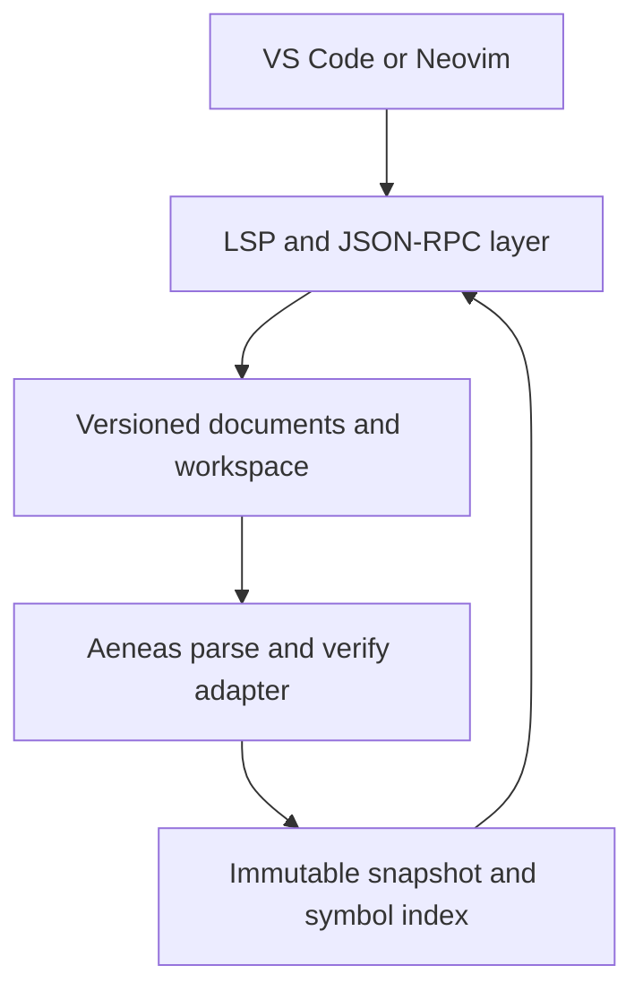

# Architecture

This document describes the intended structure of the server. Sections marked *planned* describe work in later milestones. See [ROADMAP.md](../ROADMAP.md) for the schedule.

## Overview

`virgil-lsp` is one process that communicates with the editor over standard input/output. It owns the protocol layer, the in-memory document overlays, the compiler front end, and the semantic index. Editor integrations only launch the process and forward configuration.

## Source layout

| Directory | Responsibility | Status |
| --- | --- | --- |
| `src/main.v3` | Command-line entry point | Present |
| `src/Log.v3` | Logging to standard error. Standard output is protocol-only. | Present |
| `src/analysis/` | **The only code that touches Aeneas.** Adapter, analysis snapshots, symbol indexes. | Adapter spike present |
| `src/protocol/` | Byte framing, JSON-RPC message model, lifecycle state machine | Planned (M1) |
| `src/documents/` | URIs, versioned text, `PositionMap` | Planned (M2) |
| `src/workspace/` | `.virgil-lsp.json`, glob expansion, project contexts, scheduling | Planned (M3) |
| `src/features/` | Diagnostics, symbols, definition, hover, and later features | Planned (M2–M5) |

## Build model

Virgil is a whole-program compiler. Every source file is passed to the compiler at once and shares one global namespace. The `virgil-lsp` executable is compiled from:

1. `src/main.v3` (passed first, because the first component with a `main` method becomes the entry point);
2. the rest of `src/`;
3. a generated `build/gen/BuildInfo.v3` with the version and revisions;
4. `vendor/virgil/aeneas/src/*/*.v3` and the libraries listed in `vendor/virgil/aeneas/DEPS`.

Aeneas has its own `main`, but it comes later on the command line, so it isn't selected. Because all names share one namespace, server types must not reuse Aeneas top-level names ([ADR-0002](decisions/0002-pinned-virgil-adapter-boundary.md)).

## Compiler adapter

The adapter (`src/analysis/AeneasAdapter.v3`) exposes compiler functionality in server-owned types:

- `parseFile(path, bytes)` runs `Parser.parseFile` on in-memory bytes and returns `AnalysisDiagnostic`s and a declaration count. *(present)*
- `analyzeProgram(sources)` builds a fresh `Program` from in-memory `AnalysisSource`s and runs `Compilation.parse()`, then `Compilation.verify()` if parsing succeeded. It returns a `ProgramAnalysis` with diagnostics and timing. Nothing is read from disk. Without a target, Aeneas supplies a synthetic `System` component, as it does for its interpreter. *(present; disk sources plus overlays come with the project model in M3)*
- `ProgramAnalysis.occurrences(path)` walks one verified file and follows each `VarExpr.varbind` to its source declaration (`AnalysisOccurrence`, `AnalysisDeclaration`). `definitionAt(path, line, column)` looks up the use at a compiler position. *(present for `VarExpr`)* `AppExpr.appbind`, `NamedTypeRef.binding`, and expression types follow in M4.

The adapter never runs initializers, reachability analysis, or code generation.

`build/virgil-lsp analyze [--bindings] [--stats] [--repeat=n] <file.v3>...` exercises this path from the command line.

### Known constraints of the compiler front end

The M0 spike (issue #1) measured these. They shape the analysis snapshot design below.

- **Aeneas keeps every analyzed program reachable.** `TypeCon.create` interns a composite type in the cache of a nested type's *constructor*, not in the cache that holds the nested type. Function types over tuples (any method with two or more parameters), and every composite type over an enum (enum constructors use the global cache), therefore land in the process-wide `TypeUtil.globalCache` and pin the whole `Program`. Each analysis of the Aeneas sources retains about 70 MB more. With the default 200 MB semispace heap, the second analysis in one process fails with `HeapOverflow`. Removing program-dependent entries from the global cache after an analysis stops the growth in an experiment, but one further, still unidentified root keeps the most recent large program reachable.
- **The UID counter never resets.** `UID.next` is global, and type hashes are raw UIDs. Once it passes 2^29, non-generic class types look "open", and verification crashes with `TypeCheckException` in `Type.substitute()`. One analysis of the Aeneas sources uses about 32,500 UIDs, so the limit is about 16,500 such analyses per process.
- **Verification can kill or hang the process.** Virgil has no exception handling, so a trap inside Aeneas ends the server. Inputs that are easy to produce while editing reach such traps: `def x: i32 = 0i;` (null dereference), `enum E { A(6) }` (null dereference), and `class S extends S { def f() { me; } }` (infinite loop). Valid-looking generic code can overflow the stack. A file whose last byte is `#` crashes the parser. Verifying a tree that failed to parse reaches many more traps, which is why the adapter verifies only after a clean parse.
- **Global options.** The parser and type system read `CLOptions` (language flags such as `-fun-exprs`, `-legacy-infer`). The adapter uses the defaults. Per-project compiler flags would mean setting process-wide state before each analysis.
- **At most 15 errors.** `Program.ERROR` is created with a limit of 15, and verification stops once it is reached.
- **Timing.** Parse plus verify takes about 0.1 ms for the two-file fixture and about 86 ms for the 198 Aeneas source files (80k lines) on a 2023 desktop CPU (`scripts/bench-analysis.sh`). Collecting all 161k bindings takes 29 ms with a large heap, but 240 ms with the default 200 MB heap because of GC pressure.

## Coordinates

Aeneas reports one-based lines and one-based **display columns with tab expansion**. LSP uses zero-based lines and, by default, UTF-16 code-unit offsets with no tab expansion. The adapter returns compiler coordinates unchanged. A dedicated `PositionMap` per document converts between UTF-8 byte offsets, compiler line/column pairs, and negotiated LSP positions. Subtracting one from a compiler column is wrong for tab-indented code. The unit test `AeneasAdapter:parse_tab_columns` records the current compiler behaviour.

## Analysis snapshots *(planned)*

Each analysis produces an immutable snapshot containing: the configuration revision, the document versions it used, the `Program` and verified VST, diagnostics grouped by URI, declaration and occurrence indexes, and a type/signature display cache. Handlers read the newest snapshot that matches the request's document versions. A result computed from document version *n* is never published after version *n + 1* has been accepted. When a new edit breaks parsing, navigation keeps using the last good semantic snapshot while current syntax errors are published.

## Protocol invariants *(planned, M1)*

- Each request receives exactly one response, carrying the request's original `id` (integer or string).
- Notifications never receive a response. Unknown notifications are ignored. Unknown requests receive `MethodNotFound`.
- `Content-Length` counts bytes. Reads may be partial and messages may be fragmented. Messages above a size limit are rejected.
- Standard output carries protocol bytes only.
- Advertised capabilities exactly match implemented handlers.
